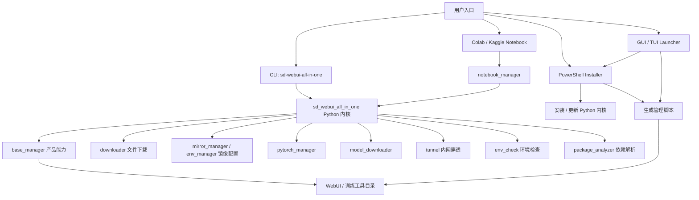

# 整体架构

SD WebUI All In One 由 Python 内核、PowerShell Installer、Notebook 和 Launcher / 下载器文档入口共同组成。用户可以从 CLI、Installer、Notebook 或 Launcher 进入，最终大多会调用 `sd_webui_all_in_one/` 中的安装、下载、镜像、隧道、模型和环境检查能力。

## 模块关系

## 主要数据流

安装流程一般从 Installer、CLI 或 Notebook 发起：先准备 Python / Git / Aria2 / uv 等基础组件，再 clone 或更新目标 WebUI 仓库，配置 PyPI / GitHub / HuggingFace / ModelScope 镜像，安装依赖和 PyTorch，最后生成或调用启动脚本。

运行流程一般由 `launch.ps1`、CLI 的 `launch` 子命令或 Notebook 的 `run()` 发起：先检查运行环境，再设置内存优化、启动参数和内网穿透，随后运行目标 WebUI / 训练工具。

维护流程包括更新仓库、切换分支、下载模型、重装 PyTorch、启动终端环境、打开版本管理 GUI。Installer 生成的管理脚本和 Python CLI 都围绕这些能力组织。

## 关键边界

- `sd_webui_all_in_one/` 是可安装的 Python 包，入口点在 `pyproject.toml` 的 `[project.scripts]`。
- `installer/*.ps1` 是可独立运行的安装器，同时负责写出后续管理脚本。
- `notebook/*.ipynb` 是云端交互入口，应尽量通过 `notebook_manager` 调用 Python 内核能力。
- `docs/` 是 Zensical 文档，用户使用说明和维护说明都应保持链接可构建。

