# 整合包下载与使用

## 简介
基于 [sd-webui-all-in-one/Installer](../installer/index.md) 全自动构建的整合包，下载解压后即可使用 Installer 生成的脚本启动和维护。首次使用前请先进入整合包目录，双击运行 `configure_env.bat` 完成环境配置，之后再运行启动、更新、模型下载、快照管理等 PowerShell 管理脚本。

可以使用 [AI 整合包下载器](../tools/portable-downloader.md) 下载并自动解压整合包；如果手动下载，整合包使用 7z 格式打包，若 Windows 系统不支持解压该格式，请使用 [7-Zip](https://7-zip.org/) / [Bandizip](https://www.bandisoft.com/bandizip/) 或者其他支持 7z 格式的工具进行解压。解压完成后务必先运行 `configure_env.bat`，否则 PowerShell 脚本可能无法正常启动。

Windows 上运行 `.ps1` PowerShell 脚本时，不要左键双击；左键双击通常会用记事本或默认编辑器打开脚本，而不是执行脚本。正确方式是右键该脚本，选择 `使用 PowerShell 运行`。如果右键运行后窗口闪退，先运行同级目录的 `configure_env.bat`，完成环境配置后再右键运行 `.ps1` 脚本。

部分 WebUI 支持使用绘世启动器进行启动和管理，运行`hanamizuki.bat`即可启动绘世启动器，如果没有这个文件说明绘世启动器不支持启动和管理该 WebUI。

如果希望使用 Launcher 管理整合包，在 Launcher 中选择对应 WebUI / 工具，并把安装路径设置为整合包解压目录。只要目录中存在 Installer 生成的管理脚本，Launcher 就可以接管并运行启动、更新、终端、模型下载和版本管理等操作。

## 管理脚本

整合包中的 PowerShell 管理脚本来自对应 Installer，文件名和功能基本统一，区别主要是脚本内部管理的 WebUI / 工具不同。例如 `launch.ps1` 在 Stable Diffusion WebUI 整合包中启动 Stable Diffusion WebUI，在 ComfyUI 整合包中启动 ComfyUI；`settings.ps1` 也是同一类设置管理入口，只是写入的本地配置会作用到当前整合包目录。

不同整合包不一定包含全部脚本，以解压目录中实际文件为准。SD Trainer Script 类整合包使用 `init.ps1` 初始化环境，并通过 `train.ps1` 编写和运行训练命令；Qwen TTS WebUI 整合包没有 `download_models.ps1`。

| 脚本 | 作用 | 备注 |
| --- | --- | --- |
| `configure_env.bat` | 首次使用前配置整合包运行环境。 | 解压后先运行一次；如果右键运行 `.ps1` 脚本后窗口闪退，也先运行该脚本。 |
| `launch.ps1` | 启动对应 WebUI / 工具。 | 大多数 WebUI 整合包的日常启动入口，会读取同级目录中的 `launch_args.txt`。 |
| `init.ps1` | 初始化 SD Trainer Script 类整合包的训练环境。 | 主要见于 SD Scripts、Musubi Tuner 等训练脚本整合包。 |
| `train.ps1` | 编写训练命令并启动训练脚本。 | 主要见于 SD Trainer Script 类整合包。 |
| `update.ps1` | 更新当前整合包管理的 WebUI / 工具。 | 通常不需要重新下载整合包即可更新。 |
| `update_extension.ps1` / `update_node.ps1` | 更新扩展或自定义节点。 | SD WebUI 系列通常是扩展，ComfyUI 通常是自定义节点。 |
| `download_models.ps1` | 下载预设模型或资源。 | 固定模型下载源前，通常需要先在 `settings.ps1` 中禁用自动镜像源选择。 |
| `switch_branch.ps1` | 切换当前 WebUI / 工具的分支或变体。 | 切换后启动参数可能不兼容，必要时删除或调整 `launch_args.txt`。 |
| `reinstall_pytorch.ps1` | 切换或重装 PyTorch。 | 常用于切换 CUDA / ROCm / XPU / ZLUDA 相关运行环境，或修复 PyTorch 安装。 |
| `version_manager.ps1` | 管理 WebUI、扩展、自定义节点或训练脚本版本。 | 可用于安装、启用 / 禁用、卸载扩展或管理版本，具体能力取决于整合包类型。 |
| `snapshot_manager.ps1` | 打开快照管理器，创建或恢复环境快照。 | 适合在更新、重装依赖或环境损坏后回退。 |
| `settings.ps1` | 管理代理、镜像源、启动参数、Hotpatcher、快照、内核路径前缀等本地设置。 | 不想手动创建配置文件时优先使用，它会在当前整合包目录写入或删除对应配置文件。 |
| `terminal.ps1` | 打开已配置好的终端环境。 | 终端内会优先使用整合包自带 Python / Git / 依赖环境。 |
| `activate.ps1` | 激活整合包环境。 | 适合已经打开 PowerShell 后手动进入当前整合包环境。 |
| `launch_*_installer.ps1` | 重新运行对应 Installer。 | 管理脚本损坏、Python / Git 环境缺失，或需要重新修复安装时使用。 |
| `hanamizuki.bat` | 启动绘世启动器。 | 只有支持绘世启动器管理的整合包才会提供。 |

## 中文 `.bat` 快捷脚本

整合包目录中还会出现一些中文命名的 `.bat` 文件，例如 `启动.bat`、`更新内核.bat`、`打开终端.bat`。这些文件是给 Windows 用户准备的快捷入口，可以直接双击运行；中文文件名表示它要执行的功能。

这些中文 `.bat` 快捷脚本通常不会实现新的管理逻辑，而是自动选择 `pwsh` 或 Windows PowerShell，再转发运行同目录中的实际管理脚本。不同整合包只会生成当前目录中实际存在目标脚本的快捷入口，以解压目录中的文件为准。

| 中文 `.bat` 脚本 | 实际运行的文件 | 说明 |
| --- | --- | --- |
| `启动.bat` | `launch.ps1` | 启动对应 WebUI / 工具。 |
| `更新内核.bat` | `update.ps1` | 更新当前整合包管理的 WebUI / 工具。 |
| `更新扩展.bat` | `update_extension.ps1` / `update_node.ps1` | 更新 SD WebUI 扩展或 ComfyUI / InvokeAI 自定义节点。 |
| `下载模型.bat` | `download_models.ps1` | 打开模型下载脚本。Qwen TTS WebUI 整合包通常没有该入口。 |
| `切换分支.bat` | `switch_branch.ps1` | 切换支持分支管理的 WebUI / 工具分支。 |
| `重装 PyTorch.bat` | `reinstall_pytorch.ps1` | 切换或重装 PyTorch。 |
| `版本管理.bat` | `version_manager.ps1` | 打开版本管理功能。 |
| `快照管理.bat` | `snapshot_manager.ps1` | 打开快照管理器。 |
| `打开 Installer 设置.bat` | `settings.ps1` | 打开 Installer 设置入口。 |
| `打开终端.bat` | `terminal.ps1` | 打开已配置好的终端环境。 |
| `启动训练.bat` | `train.ps1` | 启动 SD Trainer Script 类整合包的训练命令入口。 |
| `重新运行安装 ComfyUI.bat` | `launch_comfyui_installer.ps1` | 重新运行 ComfyUI Installer。 |
| `重新运行安装 Fooocus.bat` | `launch_fooocus_installer.ps1` | 重新运行 Fooocus Installer。 |
| `重新运行安装 InvokeAI.bat` | `launch_invokeai_installer.ps1` | 重新运行 InvokeAI Installer。 |
| `重新运行安装 Qwen TTS WebUI.bat` | `launch_qwen_tts_webui_installer.ps1` | 重新运行 Qwen TTS WebUI Installer。 |
| `重新运行安装 SD Trainer.bat` | `launch_sd_trainer_installer.ps1` | 重新运行 SD Trainer Installer。 |
| `重新运行安装 SD Trainer Script.bat` | `launch_sd_trainer_script_installer.ps1` | 重新运行 SD Trainer Script Installer。 |
| `重新运行安装 SD WebUI.bat` | `launch_stable_diffusion_webui_installer.ps1` | 重新运行 SD WebUI Installer。 |
| `启动绘世启动器.bat` | `hanamizuki.bat` | 打开绘世启动器。只有包含绘世启动器的整合包才会生成。 |
| `配置环境并修复闪退.bat` | `configure_env.bat` | 运行环境配置脚本；首次使用或 `.ps1` 运行闪退时使用。 |
| `打开帮助.bat` | `help.txt` | 打开当前整合包的帮助文档。 |
| `安装 SD WebUI All In One 启动器.bat` | 远程 Launcher 安装脚本 | 这是特殊脚本，不是转到同目录中的本地脚本。它会从 GitHub / Gitee / GitLab 下载 SD WebUI All In One Launcher 的 `install.ps1`，再运行该安装脚本。 |

## 常见配置文件

`settings.ps1` 管理的配置最终会保存在脚本同级目录中。多数 `disable_*.txt` / `enable_*.txt` 是空文件开关，文件存在就表示对应设置生效；带具体内容的 `.txt` 文件会读取文件内容。

| 配置文件 | 作用 | 备注 |
| --- | --- | --- |
| `launch_args.txt` | 保存 WebUI / 工具启动参数。 | `launch.ps1` 启动时读取；SD Trainer Script 类整合包的训练命令主要写在 `train.ps1`。 |
| `proxy.txt` / `disable_proxy.txt` | 手动指定代理，或禁用管理脚本自动设置代理。 | `proxy.txt` 中填写代理地址，例如 `http://127.0.0.1:10809`。 |
| `disable_auto_mirror.txt` | 禁用 CLI 自动镜像源选择。 | 需要手动固定 PyPI / GitHub / Hugging Face / 模型下载源时使用。 |
| `hf_mirror.txt` / `disable_hf_mirror.txt` | 自定义或禁用 Hugging Face 镜像源。 | `hf_mirror.txt` 中填写镜像地址。 |
| `gh_mirror.txt` / `disable_gh_mirror.txt` | 自定义或禁用 GitHub 镜像源。 | `gh_mirror.txt` 中填写镜像地址。 |
| `disable_pypi_mirror.txt` | 禁用 PyPI 镜像，改用 PyPI 官方源。 | 排查 Python 包下载或镜像兼容问题时使用。 |
| `disable_uv.txt` | 禁用 uv，改用 Pip 管理 Python 包。 | 排查 uv 安装问题时使用。 |
| `disable_model_mirror.txt` | 将模型下载源从 ModelScope 切换为 Hugging Face。 | 主要用于有 `download_models.ps1` 的整合包。 |
| `core_prefix.txt` | 指定 Installer 管理的内核目录名、相对路径或绝对路径。 | 移动整合包、接管外部目录或目录名不是默认值时使用。 |
| `patcher_config.json` | Hotpatcher 补丁系统配置。 | Hotpatcher 默认启用时会自动生成。 |
| `disable_hotpatcher.txt` | 禁用 Hotpatcher 补丁系统。 | 空文件开关。 |
| `enable_hotpatcher_runtime.txt` / `hotpatcher_port.txt` | 启用 Hotpatcher runtime host 连接，并指定通信端口。 | 一般用户通常不需要；端口范围为 `1` 到 `65535`。 |
| `disable_snapshot.txt` | 禁用安装结果快照和管理脚本操作前自动快照。 | 空文件开关。 |
| `disable_update.txt` | 禁用 Installer 管理脚本自动检查更新。 | 通常不建议禁用。 |
| `disable_check_env.txt` | 禁用启动前环境检查。 | 只建议临时排查时使用，可能跳过问题检测。 |
| `enable_shortcut.txt` | 允许管理脚本创建或刷新快捷启动方式。 | 不是所有整合包都会需要。 |
| `disable_set_pytorch_cuda_memory_alloc.txt` | 禁用管理脚本自动设置 PyTorch CUDA 内存分配优化。 | 遇到显存分配相关兼容问题时再考虑。 |

这些配置文件不一定都会出现；只有启用过对应设置、安装器复制了设置，或管理脚本自动生成默认配置时才会出现。需要更完整的产品差异说明时，可阅读对应 Installer 的“启动与使用”“配置与镜像”页面。

## 下载
!!! note
    Windows 用户可以优先使用 [AI 整合包下载器](../tools/portable-downloader.md)，它支持下载源切换、任务队列、自动解压和磁盘空间显示。
    
    [下载器地址 1 :material-download:](https://github.com/licyk/sd-webui-all-in-one/releases/download/portable/sd_portable_downloader.bat){ .md-button .md-button--primary }
    [下载器地址 2 :material-download:](https://gitee.com/licyk/sd-webui-all-in-one/releases/download/portable/sd_portable_downloader.bat){ .md-button }

点击对应下载按钮即可下载整合包。推荐优先下载 Nightly 版整合包。Stable 版相对较旧，Nightly 版版本更新，但未经过完整测试，不过通常也是可以正常使用的。

## Stable Diffusion WebUI
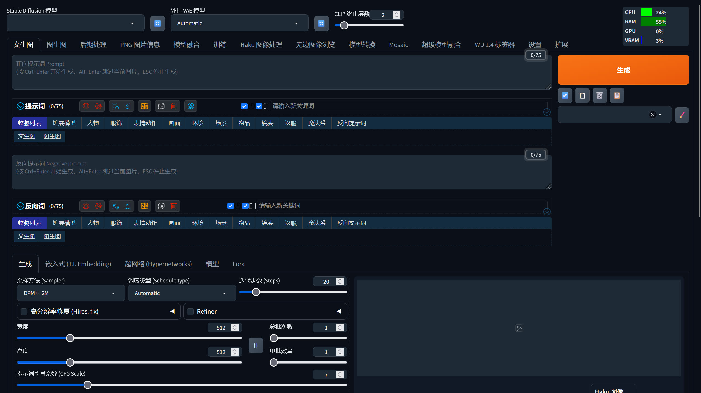

**上手简单，操作方便，适合入门使用。**

支持 SD WebUI Installer / SD WebUI All In One Launcher / 绘世启动器进行管理。

[下载 Stable 版 :material-download:](https://licyk-tools.netlify.app/#/sd_portable/download?source=modelscope&channel=stable&software=sd_webui){ .md-button }
[下载 Nightly 版 :material-download:](https://licyk-tools.netlify.app/#/sd_portable/download?source=modelscope&channel=nightly&software=sd_webui){ .md-button .md-button--primary }

### SD WebUI Installer 管理方式
- configure_env.bat：首次使用 SD WebUI Installer 需要运行一次，保证能正常运行
- launch.ps1：启动 Stable Diffusion WebUI
- update.ps1：更新 Stable Diffusion WebUI
- update_extension.ps1：更新 Stable Diffusion WebUI 扩展
- download_models.ps1：下载模型
- switch_branch.ps1：切换 Stable Diffusion WebUI 分支
- reinstall_pytorch.ps1：切换 / 重装 PyTorch
- version_manager.ps1：管理对应 WebUI / 扩展的版本，安装、启用 / 禁用、卸载扩展
- snapshot_manager.ps1：打开快照管理器，创建和恢复环境快照
- settings.ps1：SD WebUI Installer 设置
- terminal.ps1：打开终端并进入 Stable Diffusion WebUI 环境
- activate.ps1：激活 Stable Diffusion WebUI 环境
- launch_stable_diffusion_webui_installer.ps1：运行 SD WebUI Installer 并执行安装任务

SD WebUI Installer 使用说明可阅读：[SD WebUI Installer](../installer/sd-webui/index.md)

### SD WebUI All In One Launcher 管理方式
使用 [Windows GUI Launcher](../tools/launcher-gui.md) 时，在软件选择中选择 `Stable Diffusion WebUI Installer`，并在高级选项中把安装路径指向 Stable Diffusion WebUI 整合包解压目录。使用 [Bash TUI / CLI Launcher](../tools/launcher-tui.md) 时，选择项目 `sd_webui`，将 `INSTALL_PATH` 指向整合包解压目录，再通过 `manage` / `run-script` 运行管理脚本。

### 绘世启动器管理方式
- hanamizuki.bat：启动绘世启动器

详细绘世启动器使用说明可阅读：[绘世启动器使用说明 - SD Note](https://sdnote.netlify.app/sd_launcher)

## Stable Diffusion WebUI Forge
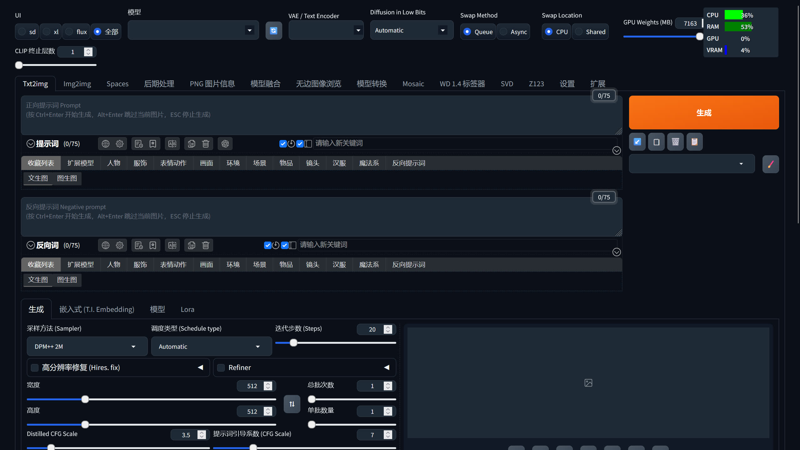

**基于 Stable Diffusion WebUI，有更强的显存优化，多了 FLUX 模型支持。**

支持 SD WebUI Installer / SD WebUI All In One Launcher / 绘世启动器进行管理。

[下载 Stable 版 :material-download:](https://licyk-tools.netlify.app/#/sd_portable/download?source=modelscope&channel=stable&software=sd_webui_forge){ .md-button }
[下载 Nightly 版 :material-download:](https://licyk-tools.netlify.app/#/sd_portable/download?source=modelscope&channel=nightly&software=sd_webui_forge){ .md-button .md-button--primary }

### SD WebUI Installer 管理方式
- configure_env.bat：首次使用 SD WebUI Installer 需要运行一次，保证能正常运行
- launch.ps1：启动 Stable Diffusion WebUI Forge
- update.ps1：更新 Stable Diffusion WebUI Forge
- update_extension.ps1：更新 Stable Diffusion WebUI Forge 扩展
- download_models.ps1：下载模型
- switch_branch.ps1：切换 Stable Diffusion WebUI Forge 分支
- reinstall_pytorch.ps1：切换 / 重装 PyTorch
- version_manager.ps1：管理对应 WebUI / 扩展的版本，安装、启用 / 禁用、卸载扩展
- snapshot_manager.ps1：打开快照管理器，创建和恢复环境快照
- settings.ps1：SD WebUI Installer 设置
- terminal.ps1：打开终端并进入 Stable Diffusion WebUI Forge 环境
- activate.ps1：激活 Stable Diffusion WebUI Forge 环境
- launch_stable_diffusion_webui_installer.ps1：运行 SD WebUI Installer 并执行安装任务

详细 SD WebUI Installer 使用说明可阅读：[SD WebUI Installer](../installer/sd-webui/index.md)

### SD WebUI All In One Launcher 管理方式
使用 [Windows GUI Launcher](../tools/launcher-gui.md) 时，在软件选择中选择 `Stable Diffusion WebUI Installer`，并在高级选项中把安装路径指向 Stable Diffusion WebUI Forge 整合包解压目录。使用 [Bash TUI / CLI Launcher](../tools/launcher-tui.md) 时，选择项目 `sd_webui`，将 `INSTALL_PATH` 指向整合包解压目录，再通过 `manage` / `run-script` 运行管理脚本。

### 绘世启动器管理方式
- hanamizuki.bat：启动绘世启动器

详细绘世启动器使用说明可阅读：[绘世启动器使用说明 - SD Note](https://sdnote.netlify.app/sd_launcher)

## Stable Diffusion WebUI reForge
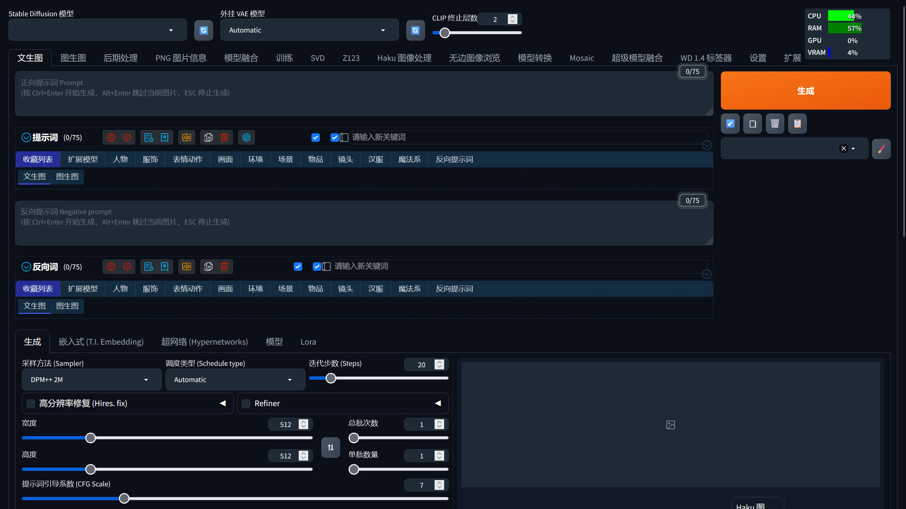

**基于旧版 Stable Diffusion WebUI Forge 开发，插件兼容性比 Stable Diffusion WebUI Forge 好一点。**

支持 SD WebUI Installer / SD WebUI All In One Launcher / 绘世启动器进行管理。

[下载 Nightly 版 :material-download:](https://licyk-tools.netlify.app/#/sd_portable/download?source=modelscope&channel=nightly&software=sd_webui_reforge){ .md-button .md-button--primary }

### SD WebUI Installer 管理方式
- configure_env.bat：首次使用 SD WebUI Installer 需要运行一次，保证能正常运行
- launch.ps1：启动 Stable Diffusion WebUI reForge
- update.ps1：更新 Stable Diffusion WebUI reForge
- update_extension.ps1：更新 Stable Diffusion WebUI reForge 扩展
- download_models.ps1：下载模型
- switch_branch.ps1：切换 Stable Diffusion WebUI reForge 分支
- reinstall_pytorch.ps1：切换 / 重装 PyTorch
- version_manager.ps1：管理对应 WebUI / 扩展的版本，安装、启用 / 禁用、卸载扩展
- snapshot_manager.ps1：打开快照管理器，创建和恢复环境快照
- settings.ps1：SD WebUI Installer 设置
- terminal.ps1：打开终端并进入 Stable Diffusion WebUI reForge 环境
- activate.ps1：激活 Stable Diffusion WebUI reForge 环境
- launch_stable_diffusion_webui_installer.ps1：运行 SD WebUI Installer 并执行安装任务

详细 SD WebUI Installer 使用说明可阅读：[SD WebUI Installer](../installer/sd-webui/index.md)

### SD WebUI All In One Launcher 管理方式
使用 [Windows GUI Launcher](../tools/launcher-gui.md) 时，在软件选择中选择 `Stable Diffusion WebUI Installer`，并在高级选项中把安装路径指向 Stable Diffusion WebUI reForge 整合包解压目录。使用 [Bash TUI / CLI Launcher](../tools/launcher-tui.md) 时，选择项目 `sd_webui`，将 `INSTALL_PATH` 指向整合包解压目录，再通过 `manage` / `run-script` 运行管理脚本。

### 绘世启动器管理方式
- hanamizuki.bat：启动绘世启动器

详细绘世启动器使用说明可阅读：[绘世启动器使用说明 - SD Note](https://sdnote.netlify.app/sd_launcher)

## Stable Diffusion WebUI Forge Neo
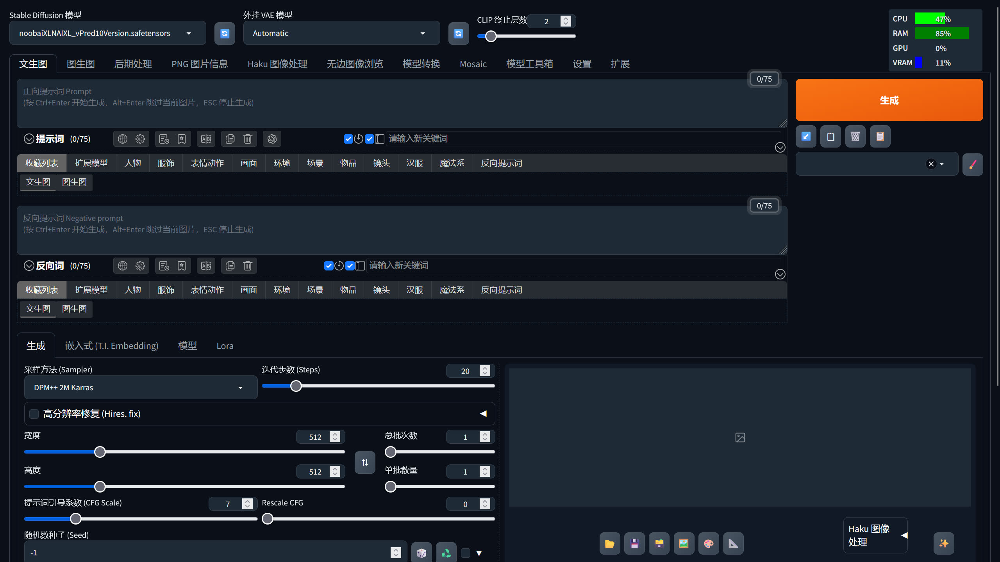

**基于旧版 Stable Diffusion WebUI Forge 开发，精简了无用组件，更轻量。**

支持 SD WebUI Installer / SD WebUI All In One Launcher / 绘世启动器进行管理。

**Nvidia 显卡版本：**

[下载 Nightly 版 :material-download:](https://licyk-tools.netlify.app/#/sd_portable/download?source=modelscope&channel=nightly&software=sd_webui_forge_neo){ .md-button .md-button--primary }

**AMD 显卡版本：**

[下载 Nightly 版 :material-download:](https://licyk-tools.netlify.app/#/sd_portable/download?source=modelscope&channel=nightly&software=sd_webui_forge_neo_rocm){ .md-button .md-button--primary }

**Intel 显卡版本：**

[下载 Nightly 版 :material-download:](https://licyk-tools.netlify.app/#/sd_portable/download?source=modelscope&channel=nightly&software=sd_webui_forge_neo_xpu){ .md-button .md-button--primary }

### SD WebUI Installer 管理方式
- configure_env.bat：首次使用 SD WebUI Installer 需要运行一次，保证能正常运行
- launch.ps1：启动 Stable Diffusion WebUI Forge Neo
- update.ps1：更新 Stable Diffusion WebUI Forge Neo
- update_extension.ps1：更新 Stable Diffusion WebUI Forge Neo 扩展
- download_models.ps1：下载模型
- switch_branch.ps1：切换 Stable Diffusion WebUI Forge Neo 分支
- reinstall_pytorch.ps1：切换 / 重装 PyTorch
- version_manager.ps1：管理对应 WebUI / 扩展的版本，安装、启用 / 禁用、卸载扩展
- snapshot_manager.ps1：打开快照管理器，创建和恢复环境快照
- settings.ps1：SD WebUI Installer 设置
- terminal.ps1：打开终端并进入 Stable Diffusion WebUI Forge Neo 环境
- activate.ps1：激活 Stable Diffusion WebUI Forge Neo 环境
- launch_stable_diffusion_webui_installer.ps1：运行 SD WebUI Installer 并执行安装任务

详细 SD WebUI Installer 使用说明可阅读：[SD WebUI Installer](../installer/sd-webui/index.md)

### SD WebUI All In One Launcher 管理方式
使用 [Windows GUI Launcher](../tools/launcher-gui.md) 时，在软件选择中选择 `Stable Diffusion WebUI Installer`，并在高级选项中把安装路径指向 Stable Diffusion WebUI Forge Neo 整合包解压目录。使用 [Bash TUI / CLI Launcher](../tools/launcher-tui.md) 时，选择项目 `sd_webui`，将 `INSTALL_PATH` 指向整合包解压目录，再通过 `manage` / `run-script` 运行管理脚本。

### 绘世启动器管理方式
- hanamizuki.bat：启动绘世启动器

详细绘世启动器使用说明可阅读：[绘世启动器使用说明 - SD Note](https://sdnote.netlify.app/sd_launcher)

## SD Next
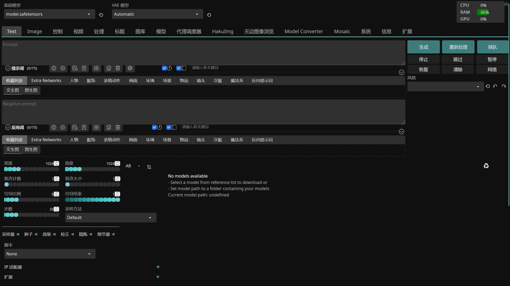

**基于 Stable Diffusion WebUI 开发，支持的模型种类多，就是比较臃肿。**

支持 SD WebUI Installer / SD WebUI All In One Launcher / 绘世启动器进行管理。

[下载 Nightly 版 :material-download:](https://licyk-tools.netlify.app/#/sd_portable/download?source=modelscope&channel=nightly&software=sd_next){ .md-button .md-button--primary }

### SD WebUI Installer 管理方式
- configure_env.bat：首次使用 SD WebUI Installer 需要运行一次，保证能正常运行
- launch.ps1：启动 SD Next
- update.ps1：更新 SD Next
- update_extension.ps1：更新 SD Next 扩展
- download_models.ps1：下载模型
- switch_branch.ps1：切换 SD Next 分支
- reinstall_pytorch.ps1：切换 / 重装 PyTorch
- version_manager.ps1：管理对应 WebUI / 扩展的版本，安装、启用 / 禁用、卸载扩展
- snapshot_manager.ps1：打开快照管理器，创建和恢复环境快照
- settings.ps1：SD WebUI Installer 设置
- terminal.ps1：打开终端并进入 SD Next 环境
- activate.ps1：激活 SD Next 环境
- launch_stable_diffusion_webui_installer.ps1：运行 SD WebUI Installer 并执行安装任务

详细 SD WebUI Installer 使用说明可阅读：[SD WebUI Installer](../installer/sd-webui/index.md)

### SD WebUI All In One Launcher 管理方式
使用 [Windows GUI Launcher](../tools/launcher-gui.md) 时，在软件选择中选择 `Stable Diffusion WebUI Installer`，并在高级选项中把安装路径指向 SD Next 整合包解压目录。使用 [Bash TUI / CLI Launcher](../tools/launcher-tui.md) 时，选择项目 `sd_webui`，将 `INSTALL_PATH` 指向整合包解压目录，再通过 `manage` / `run-script` 运行管理脚本。

### 绘世启动器管理方式
- hanamizuki.bat：启动绘世启动器

详细绘世启动器使用说明可阅读：[绘世启动器使用说明 - SD Note](https://sdnote.netlify.app/sd_launcher)

## ComfyUI
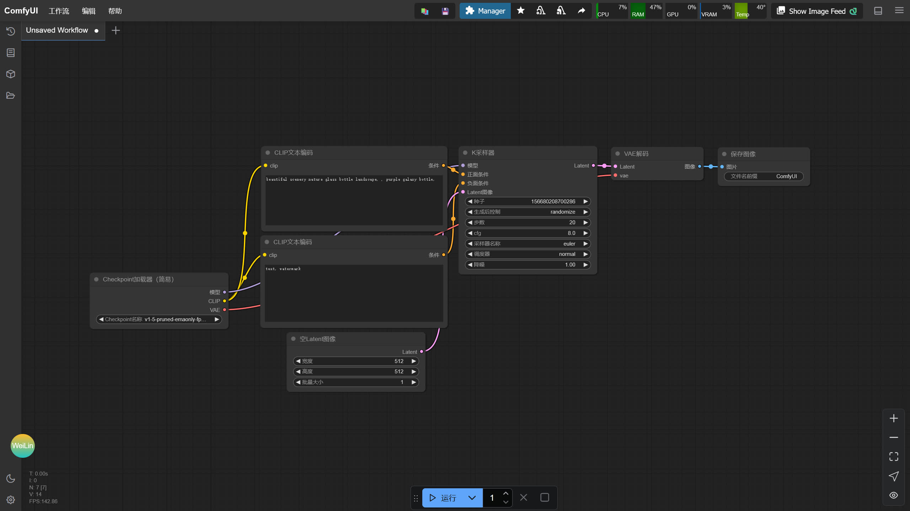

**流程高度自定义，可玩性高，显存优化强，支持的模型丰富，~~除了某些插件喜欢冲突弄坏环境~~。**

支持 ComfyUI Installer / SD WebUI All In One Launcher / 绘世启动器进行管理。

**Nvidia 显卡版本：**

[下载 Nightly 版 :material-download:](https://licyk-tools.netlify.app/#/sd_portable/download?source=modelscope&channel=nightly&software=comfyui){ .md-button .md-button--primary }

**AMD 显卡版本：**

[下载 Nightly 版 :material-download:](https://licyk-tools.netlify.app/#/sd_portable/download?source=modelscope&channel=nightly&software=comfyui_rocm){ .md-button .md-button--primary }

**Intel 显卡版本：**

[下载 Nightly 版 :material-download:](https://licyk-tools.netlify.app/#/sd_portable/download?source=modelscope&channel=nightly&software=comfyui_xpu){ .md-button .md-button--primary }

### ComfyUI Installer 管理方式
- configure_env.bat：首次使用 ComfyUI Installer 需要运行一次，保证能正常运行
- launch.ps1：启动 ComfyUI
- update.ps1：更新 ComfyUI
- update_node.ps1：更新 ComfyUI 扩展
- download_models.ps1：下载模型
- reinstall_pytorch.ps1：切换 / 重装 PyTorch
- version_manager.ps1：管理 ComfyUI / 自定义节点的版本，安装、启用 / 禁用、卸载自定义节点
- snapshot_manager.ps1：打开快照管理器，创建和恢复环境快照
- settings.ps1：ComfyUI Installer 设置
- terminal.ps1：打开终端并进入 ComfyUI 环境
- activate.ps1：激活 ComfyUI 环境
- launch_comfyui_installer.ps1：运行 ComfyUI Installer 并执行安装任务

详细 ComfyUI Installer 使用说明可阅读：[ComfyUI Installer](../installer/comfyui/index.md)

### SD WebUI All In One Launcher 管理方式
使用 [Windows GUI Launcher](../tools/launcher-gui.md) 时，在软件选择中选择 `ComfyUI Installer`，并在高级选项中把安装路径指向 ComfyUI 整合包解压目录。使用 [Bash TUI / CLI Launcher](../tools/launcher-tui.md) 时，选择项目 `comfyui`，将 `INSTALL_PATH` 指向整合包解压目录，再通过 `manage` / `run-script` 运行管理脚本。

### 绘世启动器管理方式
- hanamizuki.bat：启动绘世启动器

详细绘世启动器使用说明可阅读：[绘世启动器使用说明 - SD Note](https://sdnote.netlify.app/sd_launcher)

## Fooocus
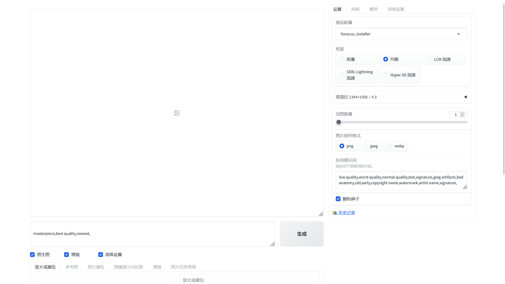

**化繁为简，更专注于提示词书写。**

支持 Fooocus Installer / SD WebUI All In One Launcher / 绘世启动器进行管理。

[下载 Stable 版 :material-download:](https://licyk-tools.netlify.app/#/sd_portable/download?source=modelscope&channel=stable&software=fooocus){ .md-button }
[下载 Nightly 版 :material-download:](https://licyk-tools.netlify.app/#/sd_portable/download?source=modelscope&channel=nightly&software=fooocus){ .md-button .md-button--primary }

### Fooocus Installer 管理方式
- configure_env.bat：首次使用 Fooocus Installer 需要运行一次，保证能正常运行
- launch.ps1：启动 Fooocus
- update.ps1：更新 Fooocus
- switch_branch.ps1：切换 Fooocus 分支
- download_models.ps1：下载模型
- reinstall_pytorch.ps1：切换 / 重装 PyTorch
- version_manager.ps1：管理 Fooocus 的版本
- snapshot_manager.ps1：打开快照管理器，创建和恢复环境快照
- settings.ps1：Fooocus Installer 设置
- terminal.ps1：打开终端并进入 Fooocus 环境
- activate.ps1：激活 Fooocus 环境
- launch_fooocus_installer.ps1：运行 Fooocus Installer 并执行安装任务

详细 Fooocus Installer 使用说明可阅读：[Fooocus Installer](../installer/fooocus/index.md)

### SD WebUI All In One Launcher 管理方式
使用 [Windows GUI Launcher](../tools/launcher-gui.md) 时，在软件选择中选择 `Fooocus Installer`，并在高级选项中把安装路径指向 Fooocus 整合包解压目录。使用 [Bash TUI / CLI Launcher](../tools/launcher-tui.md) 时，选择项目 `fooocus`，将 `INSTALL_PATH` 指向整合包解压目录，再通过 `manage` / `run-script` 运行管理脚本。

### 绘世启动器管理方式
- hanamizuki.bat：启动绘世启动器

详细绘世启动器使用说明可阅读：[绘世启动器使用说明 - SD Note](https://sdnote.netlify.app/sd_launcher)

## InvokeAI
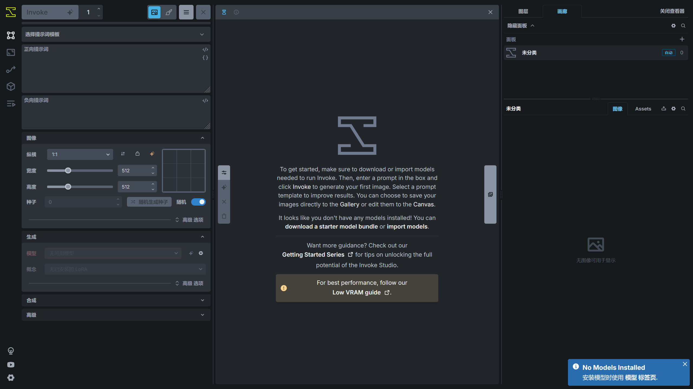

**拥有最强大的画布系统，更适合作为辅助绘画工具。**

支持 InvokeAI Installer / SD WebUI All In One Launcher 进行管理。

[下载 Nightly 版 :material-download:](https://licyk-tools.netlify.app/#/sd_portable/download?source=modelscope&channel=nightly&software=invokeai){ .md-button .md-button--primary }

### InvokeAI Installer 管理方式
- configure_env.bat：首次使用 InvokeAI Installer 需要运行一次，保证能正常运行
- launch.ps1：启动 InvokeAI
- update.ps1：更新 InvokeAI
- update_node.ps1：更新 InvokeAI 扩展
- download_models.ps1：下载模型
- reinstall_pytorch.ps1：切换 / 重装 PyTorch
- version_manager.ps1：管理 InvokeAI / 扩展的版本，安装、启用 / 禁用、卸载扩展
- snapshot_manager.ps1：打开快照管理器，创建和恢复环境快照
- settings.ps1：InvokeAI Installer 设置
- terminal.ps1：打开终端并进入 InvokeAI 环境
- activate.ps1：激活 InvokeAI 环境
- launch_invokeai_installer.ps1：运行 InvokeAI Installer 并执行安装任务

详细 InvokeAI Installer 使用说明可阅读：[InvokeAI Installer](../installer/invokeai/index.md)

### SD WebUI All In One Launcher 管理方式
使用 [Windows GUI Launcher](../tools/launcher-gui.md) 时，在软件选择中选择 `InvokeAI Installer`，并在高级选项中把安装路径指向 InvokeAI 整合包解压目录。使用 [Bash TUI / CLI Launcher](../tools/launcher-tui.md) 时，选择项目 `invokeai`，将 `INSTALL_PATH` 指向整合包解压目录，再通过 `manage` / `run-script` 运行管理脚本。

## SD-Trainer
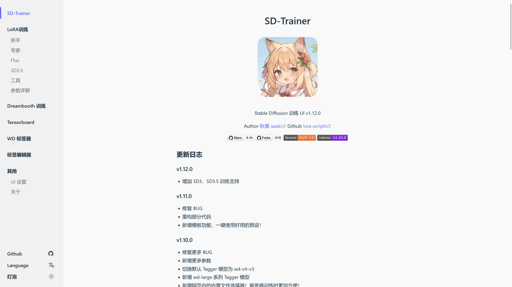

**训练模型如此简单。**

支持 SD-Trainer Installer / SD WebUI All In One Launcher / 绘世启动器进行管理。

[下载 Stable 版 :material-download:](https://licyk-tools.netlify.app/#/sd_portable/download?source=modelscope&channel=stable&software=sd_trainer){ .md-button }
[下载 Nightly 版 :material-download:](https://licyk-tools.netlify.app/#/sd_portable/download?source=modelscope&channel=nightly&software=sd_trainer){ .md-button .md-button--primary }

### SD-Trainer Installer 管理方式
- configure_env.bat：首次使用 SD-Trainer Installer 需要运行一次，保证能正常运行
- launch.ps1：启动 SD-Trainer
- update.ps1：更新 SD-Trainer
- switch_branch.ps1：切换 SD-Trainer 分支
- download_models.ps1：下载模型
- reinstall_pytorch.ps1：切换 / 重装 PyTorch
- version_manager.ps1：管理 SD-Trainer 的版本
- snapshot_manager.ps1：打开快照管理器，创建和恢复环境快照
- settings.ps1：SD-Trainer Installer 设置
- terminal.ps1：打开终端并进入 SD-Trainer 环境
- activate.ps1：激活 SD-Trainer 环境
- launch_sd_trainer_installer.ps1：运行 SD-Trainer Installer 并执行安装任务

详细 SD-Trainer Installer 使用说明可阅读：[SD Trainer Installer](../installer/sd-trainer/index.md)

### SD WebUI All In One Launcher 管理方式
使用 [Windows GUI Launcher](../tools/launcher-gui.md) 时，在软件选择中选择 `SD Trainer Installer`，并在高级选项中把安装路径指向 SD-Trainer 整合包解压目录。使用 [Bash TUI / CLI Launcher](../tools/launcher-tui.md) 时，选择项目 `sd_trainer`，将 `INSTALL_PATH` 指向整合包解压目录，再通过 `manage` / `run-script` 运行管理脚本。

### 绘世启动器管理方式
- hanamizuki.bat：启动绘世启动器

详细绘世启动器使用说明可阅读：[绘世启动器使用说明 - SD Note](https://sdnote.netlify.app/sd_launcher)

## SD-Trainer-Next
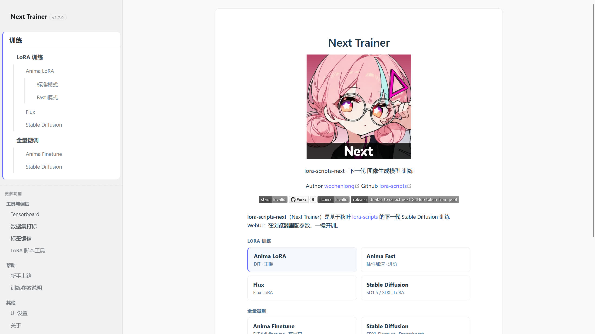

**训练模型如此简单。基于 [SD Trainer](https://github.com/Akegarasu/lora-scripts) 分支，并且新增了 Anima 模型的支持。**

支持 SD-Trainer Installer / SD WebUI All In One Launcher / 绘世启动器进行管理。

[下载 Nightly 版 :material-download:](https://licyk-tools.netlify.app/#/sd_portable/download?source=modelscope&channel=nightly&software=sd_trainer_next){ .md-button .md-button--primary }

### SD-Trainer Installer 管理方式
- configure_env.bat：首次使用 SD-Trainer Installer 需要运行一次，保证能正常运行
- launch.ps1：启动 SD-Trainer
- update.ps1：更新 SD-Trainer
- switch_branch.ps1：切换 SD-Trainer 分支
- download_models.ps1：下载模型
- reinstall_pytorch.ps1：切换 / 重装 PyTorch
- version_manager.ps1：管理 SD-Trainer 的版本
- snapshot_manager.ps1：打开快照管理器，创建和恢复环境快照
- settings.ps1：SD-Trainer Installer 设置
- terminal.ps1：打开终端并进入 SD-Trainer 环境
- activate.ps1：激活 SD-Trainer 环境
- launch_sd_trainer_installer.ps1：运行 SD-Trainer Installer 并执行安装任务

详细 SD-Trainer Installer 使用说明可阅读：[SD Trainer Installer](../installer/sd-trainer/index.md)

### SD WebUI All In One Launcher 管理方式
使用 [Windows GUI Launcher](../tools/launcher-gui.md) 时，在软件选择中选择 `SD Trainer Installer`，并在高级选项中把安装路径指向 SD Trainer Next 整合包解压目录。使用 [Bash TUI / CLI Launcher](../tools/launcher-tui.md) 时，选择项目 `sd_trainer`，将 `INSTALL_PATH` 指向整合包解压目录，再通过 `manage` / `run-script` 运行管理脚本。

### 绘世启动器管理方式
- hanamizuki.bat：启动绘世启动器

详细绘世启动器使用说明可阅读：[绘世启动器使用说明 - SD Note](https://sdnote.netlify.app/sd_launcher)

## Kohya GUI
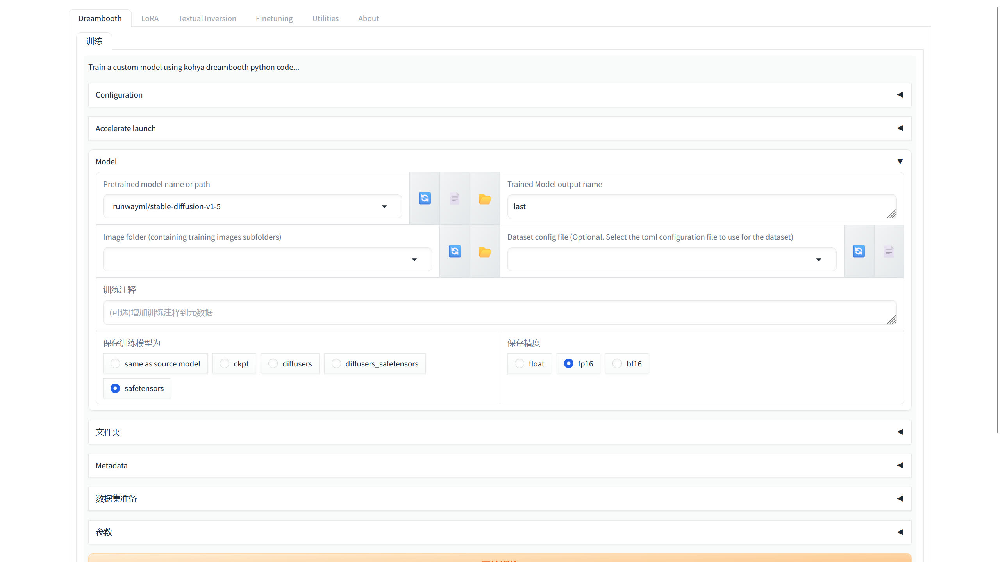

**支持训练更多种类的模型，不过操作麻烦一点。**

支持 SD-Trainer Installer / SD WebUI All In One Launcher 进行管理。

[下载 Stable 版 :material-download:](https://licyk-tools.netlify.app/#/sd_portable/download?source=modelscope&channel=stable&software=kohya_gui){ .md-button }
[下载 Nightly 版 :material-download:](https://licyk-tools.netlify.app/#/sd_portable/download?source=modelscope&channel=nightly&software=kohya_gui){ .md-button .md-button--primary }

### SD-Trainer Installer 管理方式
- configure_env.bat：首次使用 SD-Trainer Installer 需要运行一次，保证能正常运行
- launch.ps1：启动 Kohya GUI
- update.ps1：更新 Kohya GUI
- switch_branch.ps1：切换 Kohya GUI 分支
- download_models.ps1：下载模型
- reinstall_pytorch.ps1：切换 / 重装 PyTorch
- version_manager.ps1：管理 Kohya GUI 的版本
- snapshot_manager.ps1：打开快照管理器，创建和恢复环境快照
- settings.ps1：SD-Trainer Installer 设置
- terminal.ps1：打开终端并进入 Kohya GUI 环境
- activate.ps1：激活 Kohya GUI 环境
- launch_sd_trainer_installer.ps1：运行 SD-Trainer Installer 并执行安装任务

详细 SD-Trainer Installer 使用说明可阅读：[SD Trainer Installer](../installer/sd-trainer/index.md)

### SD WebUI All In One Launcher 管理方式
使用 [Windows GUI Launcher](../tools/launcher-gui.md) 时，在软件选择中选择 `SD Trainer Installer`，并在高级选项中把安装路径指向 Kohya GUI 整合包解压目录。使用 [Bash TUI / CLI Launcher](../tools/launcher-tui.md) 时，选择项目 `sd_trainer`，将 `INSTALL_PATH` 指向整合包解压目录，再通过 `manage` / `run-script` 运行管理脚本。

## SD Scripts

**支持训练 SD1.5，SDXL，FLUX，ControlNet 等多种模型，并且是 SD-Trainer 和 Kohya GUI 的训练核心，不过操作比较麻烦。**

支持 SD-Trainer-Script Installer / SD WebUI All In One Launcher 进行管理。

[下载 Nightly 版 :material-download:](https://licyk-tools.netlify.app/#/sd_portable/download?source=modelscope&channel=nightly&software=sd_scripts){ .md-button .md-button--primary }

### SD-Trainer-Script Installer 管理方式
- configure_env.bat：首次使用 SD-Trainer-Script Installer 需要运行一次，保证能正常运行
- init.ps1：初始化 SD Scripts 基础环境
- train.ps1：用于编写训练命令并启动 SD Scripts
- update.ps1：更新 SD Scripts
- download_models.ps1：下载模型
- reinstall_pytorch.ps1：切换 / 重装 PyTorch
- version_manager.ps1：管理 SD-Trainer-Script 的版本
- snapshot_manager.ps1：打开快照管理器，创建和恢复环境快照
- settings.ps1：SD-Trainer-Script Installer 设置
- terminal.ps1：打开终端并进入 SD Scripts 环境
- activate.ps1：激活 SD Scripts 环境
- launch_sd_trainer_script_installer.ps1：运行 SD-Trainer-Script Installer 并执行安装任务

详细 SD-Trainer Installer 使用说明可阅读：[SD Trainer Script Installer](../installer/sd-trainer-script/index.md)

### SD WebUI All In One Launcher 管理方式
使用 [Windows GUI Launcher](../tools/launcher-gui.md) 时，在软件选择中选择 `SD Trainer Script Installer`，并在高级选项中把安装路径指向 SD Scripts 整合包解压目录。使用 [Bash TUI / CLI Launcher](../tools/launcher-tui.md) 时，选择项目 `sd_trainer_script`，将 `INSTALL_PATH` 指向整合包解压目录，再通过 `manage` / `run-script` 运行管理脚本。

## Musubi Tuner

**支持训练 Hunyuan，Wan 等视频生成模型。**

支持 SD-Trainer-Script Installer / SD WebUI All In One Launcher 进行管理。

[下载 Nightly 版 :material-download:](https://licyk-tools.netlify.app/#/sd_portable/download?source=modelscope&channel=nightly&software=musubi_tuner){ .md-button .md-button--primary }

### SD-Trainer-Script Installer 管理方式
- configure_env.bat：首次使用 SD-Trainer-Script Installer 需要运行一次，保证能正常运行
- init.ps1：初始化 Musubi Tuner 基础环境
- train.ps1：用于编写训练命令并启动 Musubi Tuner
- update.ps1：更新 Musubi Tuner
- download_models.ps1：下载模型
- reinstall_pytorch.ps1：切换 / 重装 PyTorch
- version_manager.ps1：管理 SD-Trainer-Script 的版本
- snapshot_manager.ps1：打开快照管理器，创建和恢复环境快照
- settings.ps1：SD-Trainer-Script Installer 设置
- terminal.ps1：打开终端并进入 Musubi Tuner 环境
- activate.ps1：激活 Musubi Tuner 环境
- launch_sd_trainer_script_installer.ps1：运行 SD-Trainer-Script Installer 并执行安装任务

详细 SD-Trainer-Script Installer 使用说明可阅读：[SD Trainer Script Installer](../installer/sd-trainer-script/index.md)

### SD WebUI All In One Launcher 管理方式
使用 [Windows GUI Launcher](../tools/launcher-gui.md) 时，在软件选择中选择 `SD Trainer Script Installer`，并在高级选项中把安装路径指向 Musubi Tuner 整合包解压目录。使用 [Bash TUI / CLI Launcher](../tools/launcher-tui.md) 时，选择项目 `sd_trainer_script`，将 `INSTALL_PATH` 指向整合包解压目录，再通过 `manage` / `run-script` 运行管理脚本。

## Qwen TTS WebUI
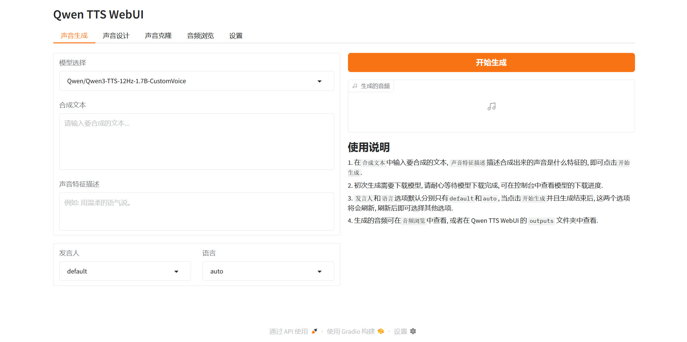

**支持使用 Qwen3 TTS 生成语音。**

支持 Qwen TTS WebUI Installer / SD WebUI All In One Launcher 进行管理。

[下载 Nightly 版 :material-download:](https://licyk-tools.netlify.app/#/sd_portable/download?source=modelscope&channel=nightly&software=qwen_tts_webui){ .md-button .md-button--primary }

### Qwen TTS WebUI Installer 管理方式
- configure_env.bat：首次使用 Qwen TTS WebUI Installer 需要运行一次，保证能正常运行
- launch.ps1：启动 Qwen TTS WebUI
- update.ps1：更新 Qwen TTS WebUI
- reinstall_pytorch.ps1：切换 / 重装 PyTorch
- version_manager.ps1：管理 Qwen TTS WebUI 的版本
- snapshot_manager.ps1：打开快照管理器，创建和恢复环境快照
- settings.ps1：Qwen TTS WebUI Installer 设置
- terminal.ps1：打开终端并进入 Qwen TTS WebUI 环境
- activate.ps1：激活 Qwen TTS WebUI 环境
- launch_qwen_tts_webui_installer.ps1：运行 Qwen TTS WebUI Installer 并执行安装任务

详细 Qwen TTS WebUI Installer 使用说明可阅读：[Qwen TTS WebUI Installer](../installer/qwen-tts-webui/index.md)

### SD WebUI All In One Launcher 管理方式
使用 [Windows GUI Launcher](../tools/launcher-gui.md) 时，在软件选择中选择 `Qwen TTS WebUI Installer`，并在高级选项中把安装路径指向 Qwen TTS WebUI 整合包解压目录。使用 [Bash TUI / CLI Launcher](../tools/launcher-tui.md) 时，选择项目 `qwen_tts_webui`，将 `INSTALL_PATH` 指向整合包解压目录，再通过 `manage` / `run-script` 运行管理脚本。

## 所有版本
整合包存储在 [HuggingFace](https://huggingface.co/licyk/sd-webui-all-in-one/tree/main/portable) / [ModelScope](https://modelscope.cn/models/licyks/sd-webui-all-in-one/files) 中。

**整合包合集链接：[AI 整合包下载 - licyk在线工具集](https://licyk.github.io/t/#/sd_portable)**

!!! note
    1. 整合包分为 Stable 和 Nightly 版本，Nightly 版本是未经测试的版本，并且使用日期进行命名，如`comfyui_licyk_20250322_nightly`，`comfyui`代表该整合包为 ComfyUI 整合包，`20250322`代表整合包在 2025.3.22 时进行构建。虽然 Nightly 版本未经过测试，但通常是可以使用的。
    2. Stable 版本为 Nightly 版本中经过测试的版本，但因为作者时间问题，Stable 版本并不会经常更新。
    3. 使用 [sd-webui-all-in-one/Installer](../installer/index.md) 安装的 WebUI 和使用整合包没什么区别，因为这些整合包就是使用 [sd-webui-all-in-one/Installer](../installer/index.md) 进行构建的。
    4. 更新 WebUI / ComfyUI / ... 通常情况下不需要重新下载整合包，使用 [sd-webui-all-in-one/Installer](../installer/index.md)、[SD WebUI All In One Launcher](../tools/index.md) 或者绘世启动器即可对 WebUI / ComfyUI / ... 进行更新。
