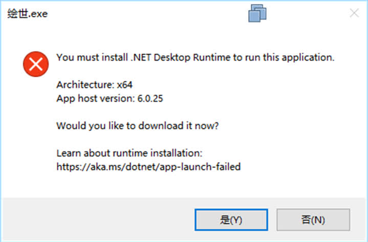

# 常见问题
常见问题通常可在 [SD Note 帮助文档](https://licyk.github.io/SDNote/) 和本项目文档中找到解决方法，没找到的问题也可以善用搜索引擎解决。

!!! note
    文档写了还不一定有人看，看了还不一定会……  
    

## 打开绘世启动器时出现 You must install .NET Desktop Runtime to run this application

绘世启动器基于 .NET 进行开发，需要安装 .NET 运行时才能运行，跟着提示安装就行了。

## 运行 PowerShell 脚本闪退
先重新运行一次 `configure_env.bat` 脚本，完成环境配置后再运行 PowerShell 脚本。

Windows 上不要左键双击 `.ps1` PowerShell 脚本；左键双击通常会用记事本或默认编辑器打开脚本，而不是执行脚本。正确方式是右键该脚本，选择 `使用 PowerShell 运行`。

!!! note
    待补充其他问题
