# AMD ZLUDA 使用

!!! warning
    本方法依赖旧版 PyTorch（如 Torch 2.3.0 + CUDA 11.8）配合 ZLUDA 使用，可能已经不适配新版 PyTorch。部分 WebUI 或工作流需要新版 PyTorch 才能正常运行，例如较新的 ComfyUI 环境可能依赖新版 PyTorch，此时无法使用本方案。请优先确认目标 WebUI / 插件 / 节点对 PyTorch 版本的要求，再决定是否按本文方法切换到旧版 PyTorch。

本文适用于 Windows 平台的 AMD RX 系列显卡和 AMD 780M / 680M 核显用户，通过绘世启动器启用 ZLUDA 引擎运行 SD WebUI、SD WebUI Forge、ComfyUI 或 Fooocus。

目前在 ROCm 未在 Windows 上正式发布，则 AMD 显卡想要在 Windows 平台上跑图，需要借助 ZLUDA 进行转译。Installer 暂未提供 ZLUDA 功能支持（因技术原因），所以需使用绘世启动器提供 ZLUDA 功能支持，下面介绍了在 SD WebUI 上的操作方法，同时该方法也适用于 SD WebUI Forge、ComfyUI 和 Fooocus。

!!! info
    方法适用于 AMD RX 系列显卡和 AMD 780M 显卡，除了 SD WebUI 可以用这个方式，SD WebUI Forge、ComfyUI 和 Fooocus 都可以用，可自行测试。

## 1. 安装 SD WebUI
在 [整合包下载](./portable.md) 里找到 Stable Diffusion WebUI 整合包，下 Stable 版或者 Nightly 版都可以，然后解压。不用整合包安装的方式也可以用 Installer 从头一键安装，去  [SD WebUI Installer](../installer/sd-webui/index.md) 文档里按照说明操作就行。

!!! note
    **如果用的是整合包就直接跳过这蓝色部分的说明**，整合包用的是 Installer 的构建模式制作出来的，把绘世启动器什么的都配置好了。而自己使用 Installer 安装环境的话，如果只是使用默认参数直接右键启动安装脚本，是不会做额外的环境配置（除非根据 Installer 文档使用构建模式去启动安装脚本）。
    
    要做的额外步骤如下：
    
    ### 切换 SD WebUI 分支到测试分支
    在安装目录中找到 switch_branch.ps1，右键运行，然后选择`AUTOMATIC1111 - Stable-Diffusion-WebUI 测试分支`并切换。
    
    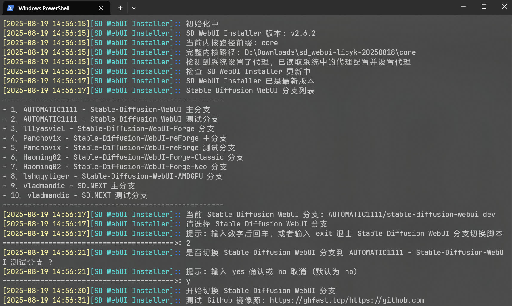
    
    ### 安装绘世启动器
    在安装目录中找到 terminal.ps1，右键运行，运行后会打开终端，输入下面的命令后回车运行。
    
    ```powershell
    Install-Hanamizuki
    ```
    
    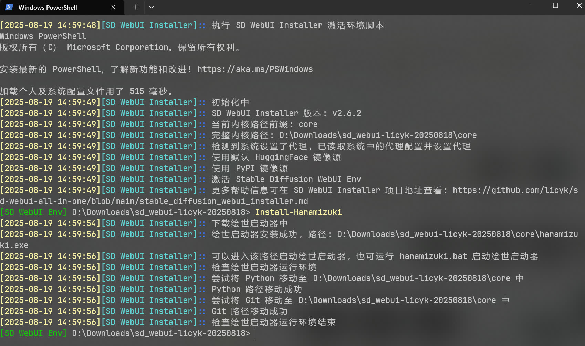
    
    这样额外步骤就做完了。

## 2. 安装 HIP SDK
打开 [AMD HIP SDK for Windows](https://www.amd.com/en/developer/resources/rocm-hub/hip-sdk.html) 这个下载页面，找到 OS 是 Windows 10 & 11 和 ROCm Version 是 5.7.1 的那行，点右边的下载。

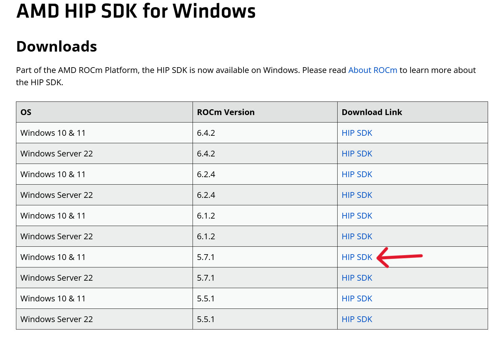

在下载页面翻到最底下有个 Accept 按钮，点击就可以下载 HIP SDK。

下载完成后就可以安装，一直点下一步就行，如果系统里安装了其他版本的 HIP SDK 就先卸载掉，再安装。**安装完成后必须重启电脑！**

## 3. 重装 PyTorch
默认带的 PyTorch 是没法正常跑 ZLUDA 的，要重新安装，在安装目录中找到 reinstall_pytorch.ps1，右键运行，选择`Torch 2.3.0 (CUDA 11.8) + xFormers 0.0.26.post1`这个 PyTorch 组合后重新安装。

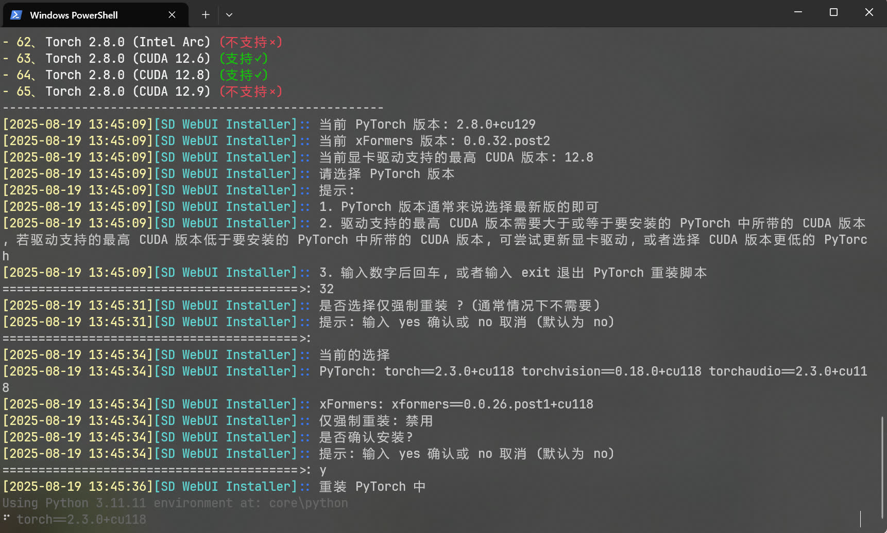

## 4. 额外配置 ZLUDA
!!! info
    如果 AMD 显卡的型号是 AMD 780M / 680M，就需要额外的配置 ZLUDA，其他 AMD 显卡可以跳过这个步骤。

下载 [780m_20240321_163205.7z](https://modelscope.cn/models/licyks/sdnote/resolve/master/other/780m_20240321_163205.7z) 这个压缩包，然后把压缩包里的 2 个文件解压到 SD WebUI 内核目录。

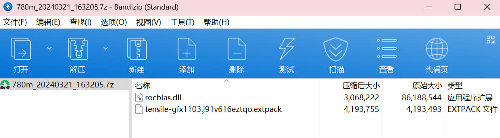

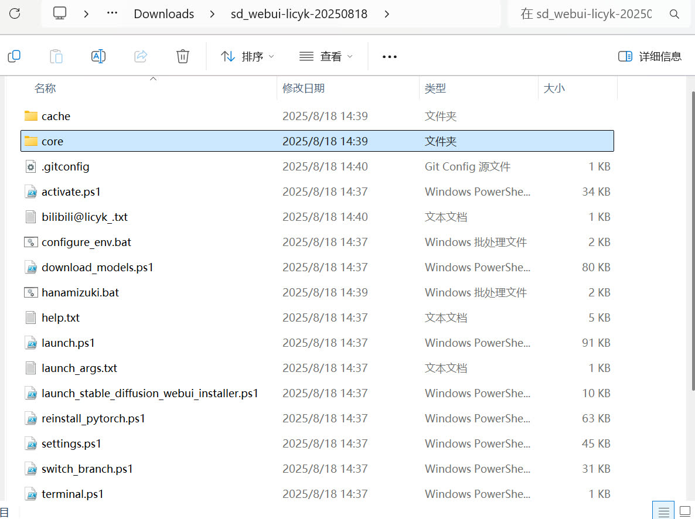

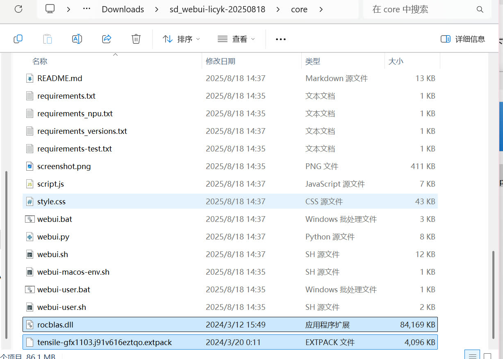

## 5. 安装模型
在安装目录中找到 download_models.ps1，右键运行，找个合适的模型下载就行。

如果是 AMD 780M 显卡，那点显存只能跑 SD1.5 的模型，推荐 nai1-artist_all_in_one_merge.safetensors。

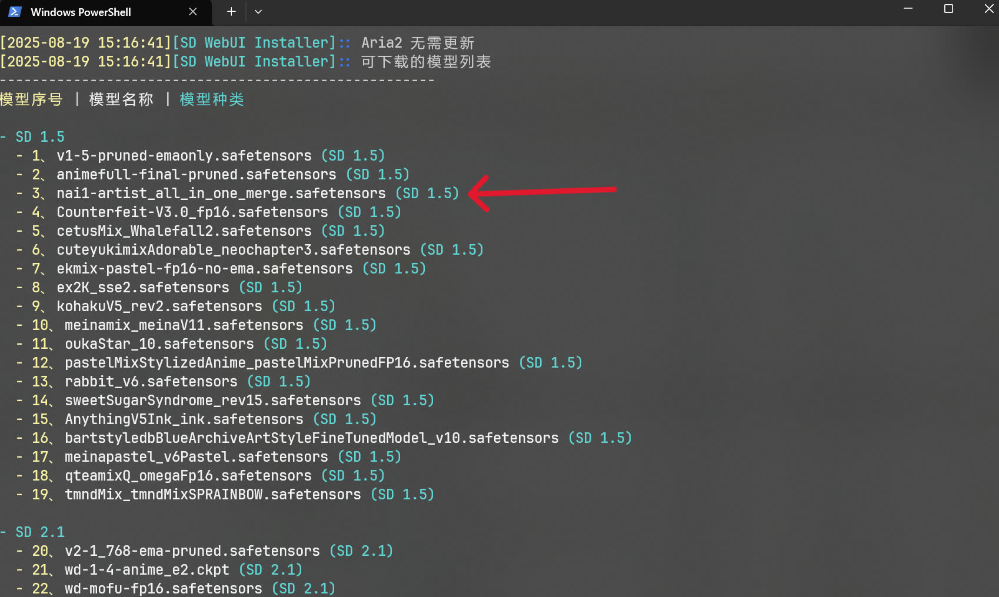

如果是 AMD RX 系列的显卡，可以下 SDXL 的模型，推荐这几个。

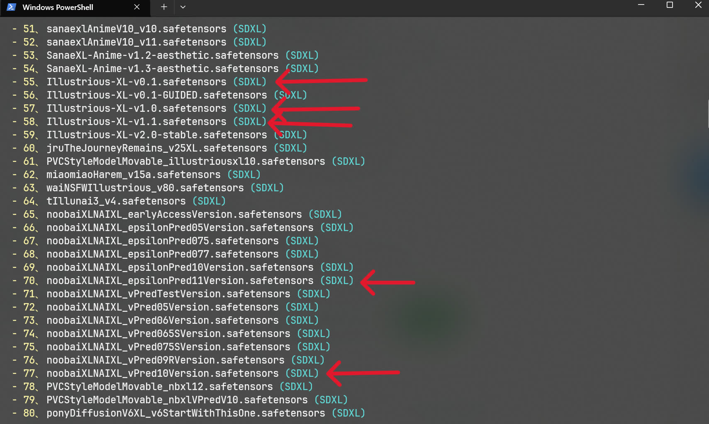

## 6. 使用绘世启动器启动
在安装目录中找到 hanamizuki.bat，双击打开后就会启动绘世启动器，在绘世启动器的高级选项中，可以选择 ZLUDA 引擎去启动。

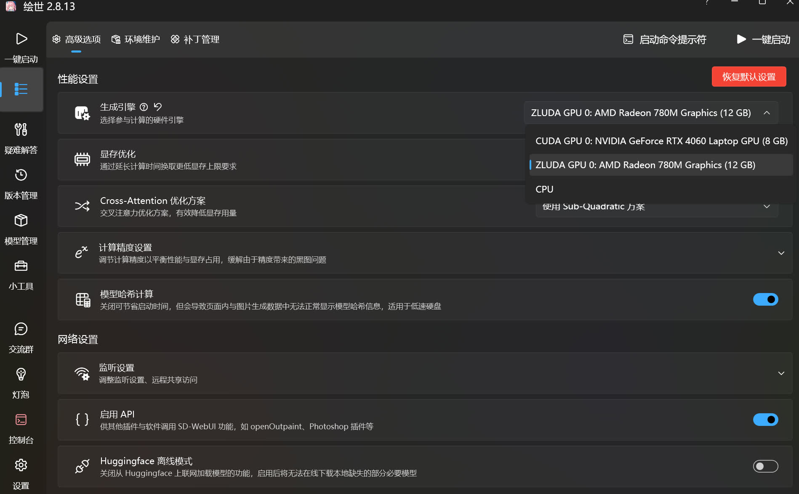

选择 ZLUDA 引擎后就可以点一键启动去启动 SD WebUI。

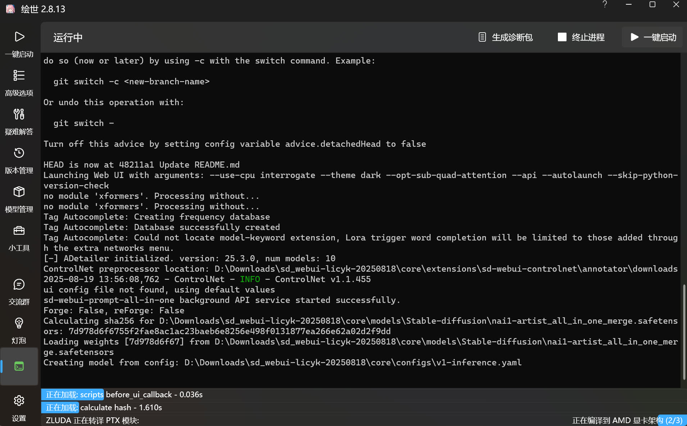

第一次启动会经历非常长时间的 ZLUDA 转译，快的话 20 分钟左右，慢的话可能一两个小时，这个只能等。

## 7. 跑图测试
提示词放这了。

- 正面提示词
```
tyomimas,
1girl,solo,cat ears,animal ear fluff,hair ornament,hair bow,long hair,blonde hair,low ponytail,twintails,blue eyes,open mouth,blue bow,dress,blue dress,braid,short sleeves,white frills,
holding pillow,pillow hug,sitting,on couch,looking at viewer,light smile,open mouth,
couch,indoors,room,desk,vase,flower,
front view,
masterpiece,best quality,newest,
```

- 负面提示词
```
low quality,worst quality,normal quality,text,signature,jpeg artifacts,bad anatomy,old,early,copyright name,watermark,artist name,signature,
```

跑图时也会有 ZLUDA 转译，只能等，完整跑完一次图后一般就不会有 ZLUDA 转译的过程了。

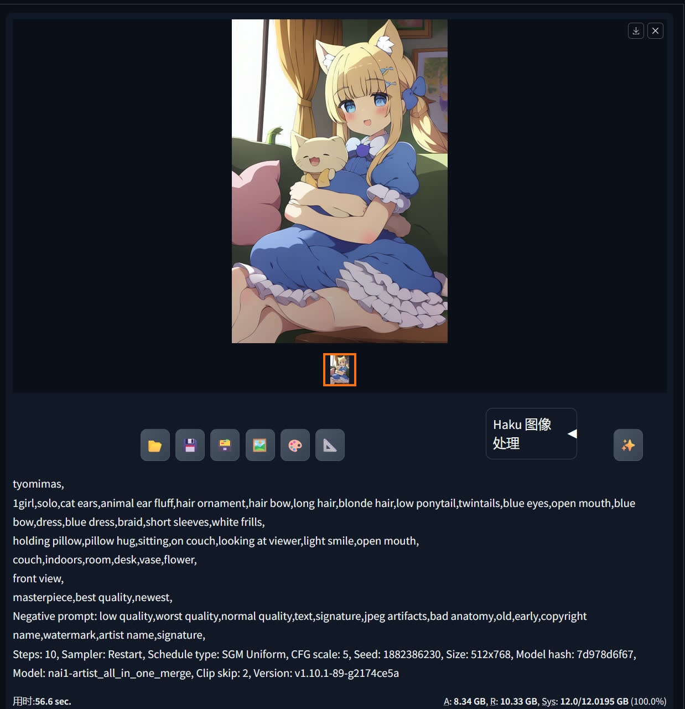

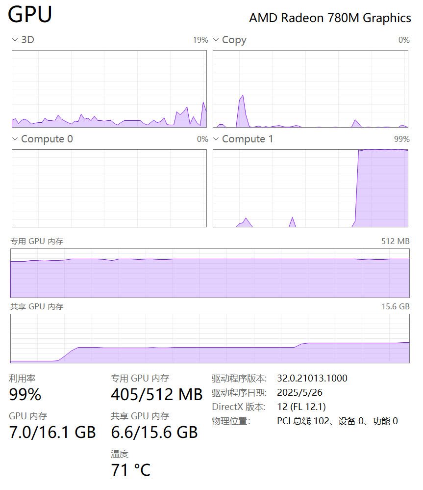

出现`OutOfMemoryError: CUDA out of memory`就把分辨率调小点，再启用 Tiled VAE。

出现`NansException: A tensor with NaNs was produced in Unet.`就在绘世启动器的**性能设置 -> 计算精度设置**里把**开启 UNet 模型半精度优化关了**，不过爆显存概率会增大很多。
