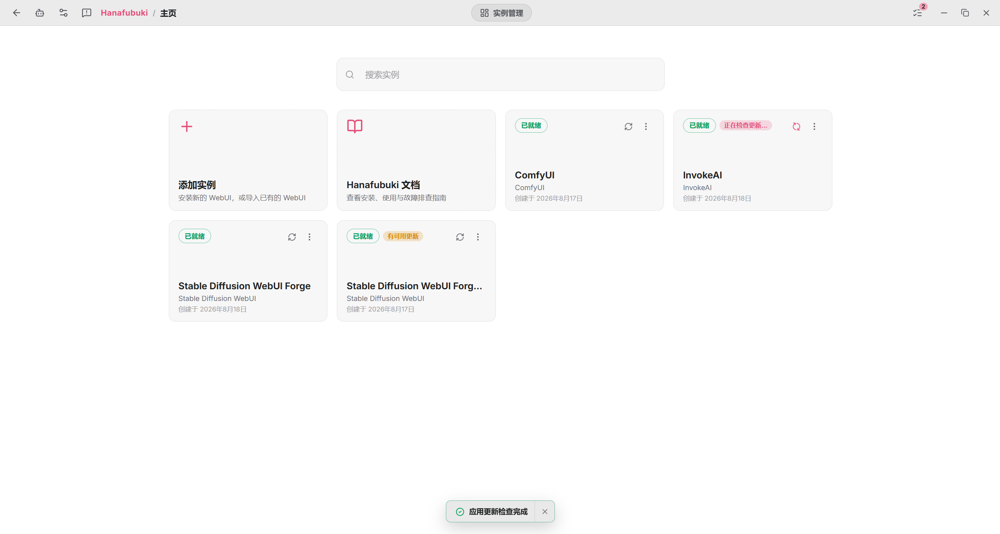

# Hanafubuki

Hanafubuki 是本项目现在优先推荐的全平台桌面管理器，可以在 Windows、macOS 和 Linux 上安装、导入、启动和维护本地生成式 AI WebUI。它将 Python、Git、启动参数、版本、模型、扩展、快照、任务和诊断信息集中在同一个工作区中。

[访问 Hanafubuki 官网 :material-home:](https://hanafubuki.netlify.app){ .md-button }
[立即下载 :material-download:](https://hanafubuki.netlify.app/download){ .md-button .md-button--primary }

## 支持的平台和 WebUI

Hanafubuki 支持 Windows、macOS 和 Linux。Windows 提供 x86_64 版本，macOS 和 Linux 同时提供 x86_64 与 ARM64 版本。

目前可以管理以下六类 WebUI：

- Stable Diffusion WebUI，包括 Forge、reForge、Forge Neo、SD.Next 等变体。
- ComfyUI。
- InvokeAI。
- Fooocus。
- SD Trainer，包括 SD Trainer Next、Kohya GUI 等变体。
- Qwen TTS WebUI。

SD Scripts、Musubi Tuner 等训练脚本目前继续使用 Installer 管理脚本或 [Bash TUI / CLI Launcher](./launcher-tui.md)。

## 选择安装包还是便携版

下载页提供“安装包”和“便携版”两种获取方式。两者运行的是同一个 Hanafubuki，但安装方式、数据位置和更新方式不同。

| 对比项 | 安装包 | 便携版 |
| --- | --- | --- |
| 使用方式 | 安装后从桌面、开始菜单或应用列表启动 | 解压后运行独立 Launcher |
| 应用本体 | 已包含在安装包中 | Launcher 首次启动时下载并校验，文件损坏时自动修复 |
| 数据位置 | 系统的应用数据目录 | Launcher 旁边的 `.hanafubuki-launcher` 目录 |
| 更新方式 | 推荐安装格式支持在应用内检查并安装更新 | 由 Launcher 管理应用本体，具体更新说明以官网文档为准 |
| 推荐场景 | 长期在一台固定设备上使用 | 移动硬盘、整套迁移，或保存多套互不干扰的环境 |

一般用户单独下载 Hanafubuki 时，推荐选择安装包。需要让应用、配置和实例数据跟随目录移动时，再选择便携版。

!!! warning "免安装压缩包不等于便携版"

    下载页“安装包”列表中的 Windows 免安装压缩包只是不执行安装程序，数据仍写入系统应用数据目录。需要数据保存在程序旁边时，应选择单独列出的“便携版”。

## 使用整合包内置的 Hanafubuki

受支持的 Windows 整合包已经随产品一起提供 `hanafubuki-launcher.exe`。这属于 Hanafubuki 便携版，不需要再次从官网下载启动器。

1. 下载并解压整合包。
2. 双击解压目录中的 `hanafubuki-launcher.exe`。
3. 首次运行时等待 Launcher 下载、校验并启动 Hanafubuki 本体。
4. Hanafubuki 会发现放在旁边的 WebUI；进入实例后即可启动或执行版本、模型、扩展和其他维护操作。

如果 Launcher 无法识别目录，可以在 Hanafubuki 首页选择“添加实例”，再使用“导入现有实例”或“扫描系统”。导入只接入现有文件，不会复制 WebUI 目录；后续管理操作仍可能修改其中的环境、代码、扩展或模型。

## 单独安装并管理 WebUI

1. 从[下载页](https://hanafubuki.netlify.app/download)获取适合当前平台的安装包或便携版。
2. 首次启动后等待 Python、Micromamba 和 Git 等运行组件准备完成。
3. 在首页选择“添加实例”。没有现成 WebUI 时选择“全新安装”；已有目录时选择“导入现有实例”或“扫描系统”。
4. 打开实例，在实例信息或工作区中启动 WebUI。
5. 通过实例管理页维护版本、扩展、模型、PyTorch、快照和路径，并从任务中心查看长时间任务的输出。

Hanafubuki 仍在持续开发。执行版本切换、扩展卸载、实例迁移、重装或删除前，应先为重要模型、输出、配置和自定义代码创建独立备份。

## 旧版 Windows GUI Launcher 用户

旧版 Windows GUI Launcher 的配置不会自动迁移。原 WebUI 文件无需重新下载，可以通过 Hanafubuki 的“导入现有实例”或“扫描系统”重新接入。旧启动器说明仍保留在[旧版 Windows GUI Launcher](./launcher-gui.md)页面，仅用于兼容和历史查阅。
