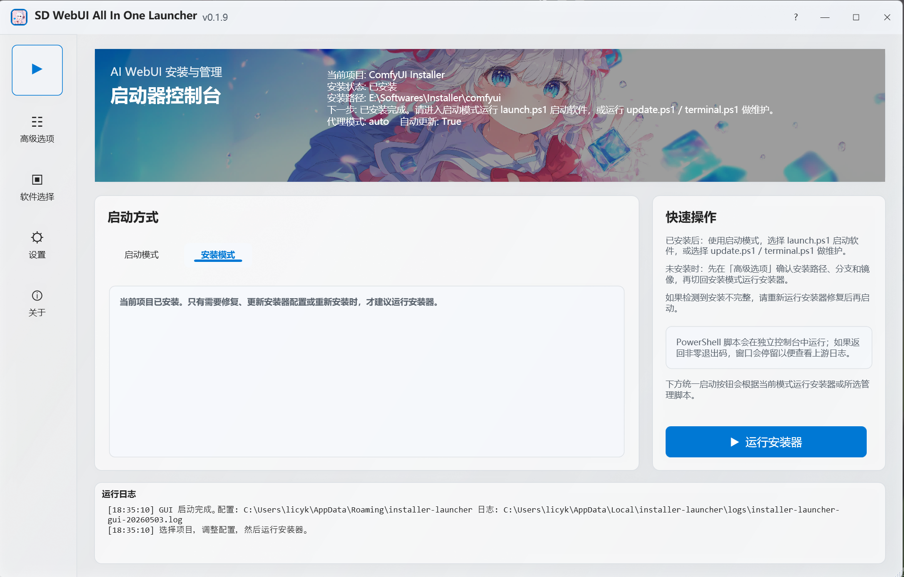
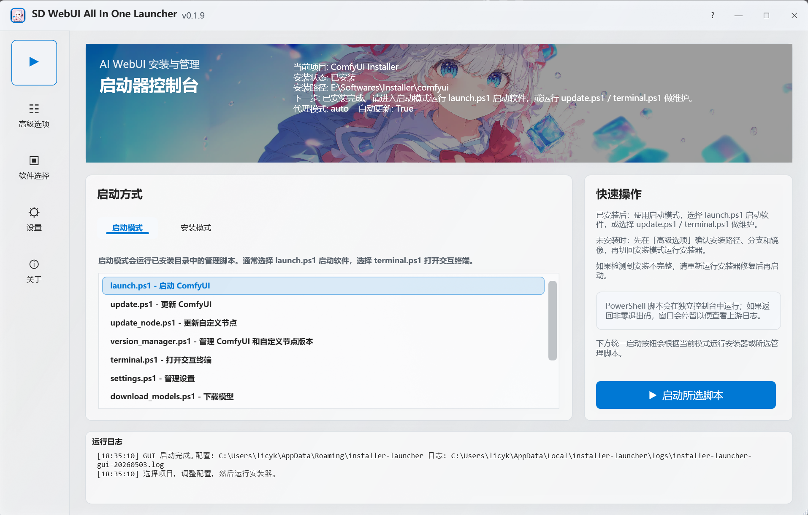
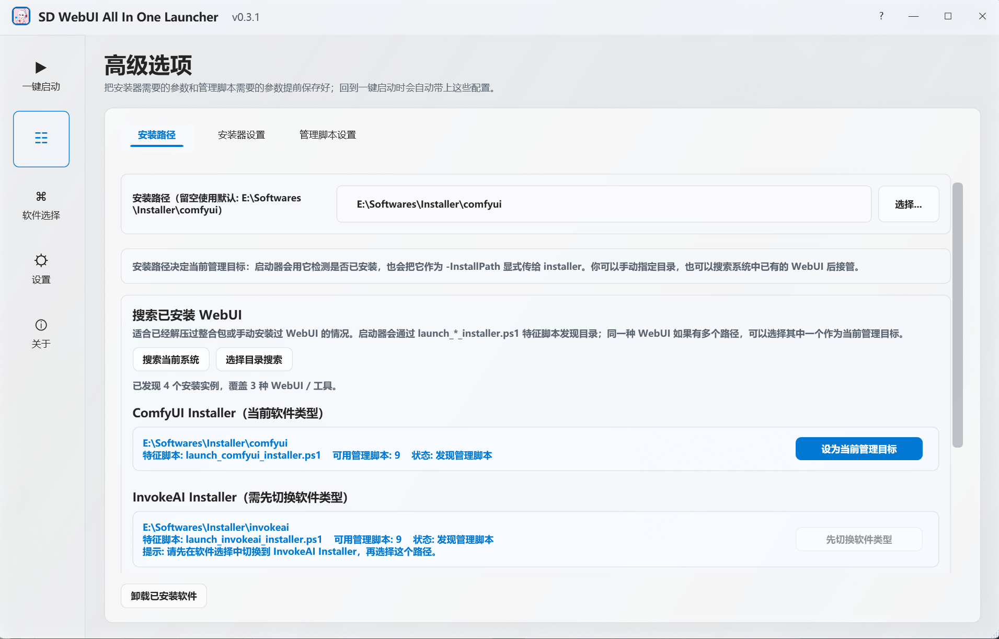
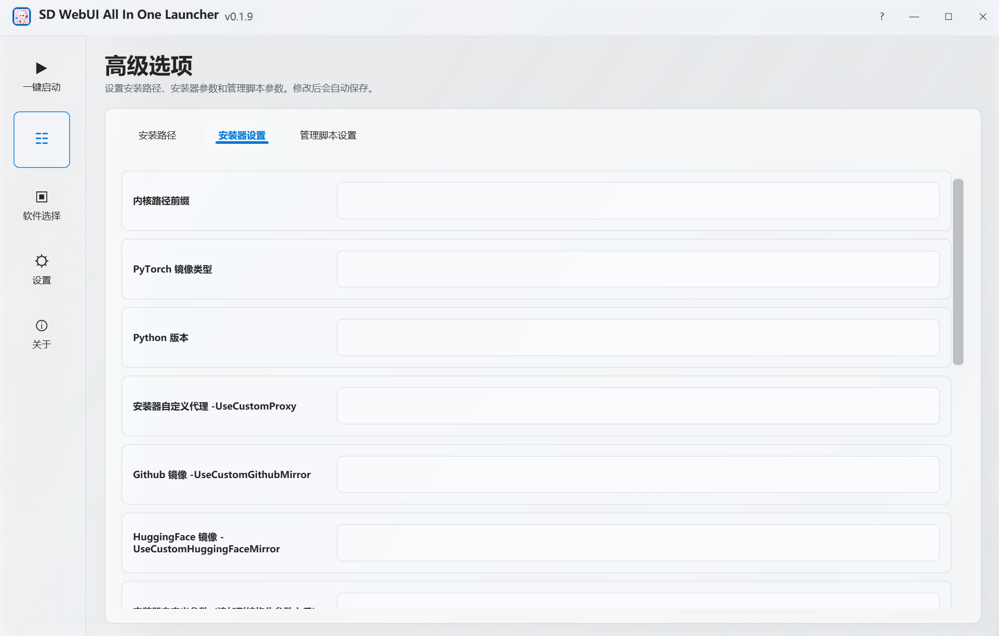
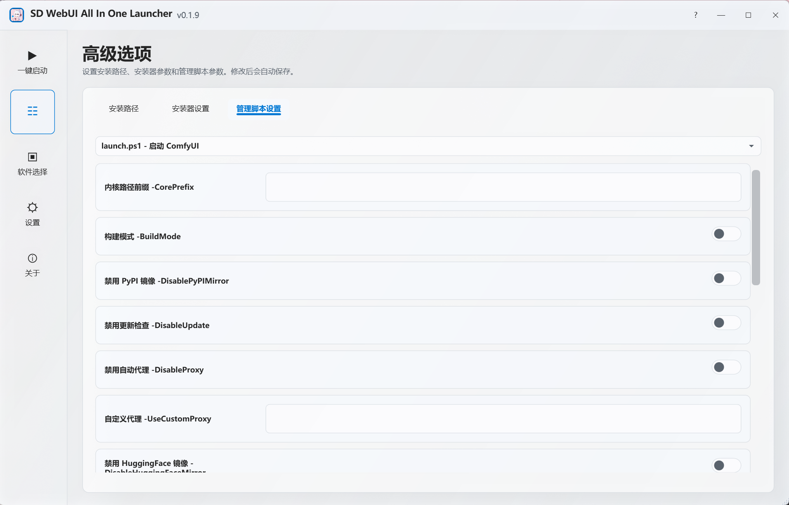
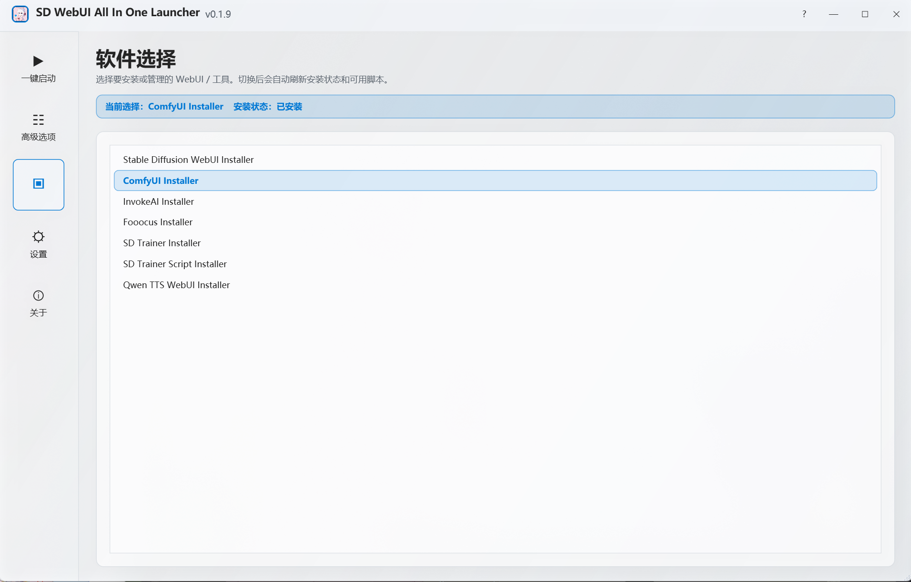
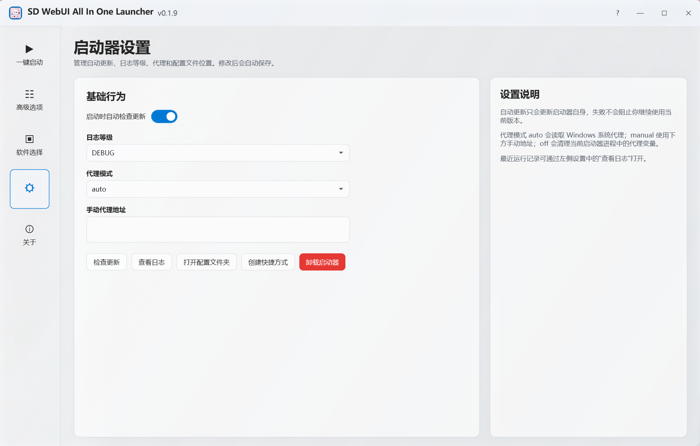
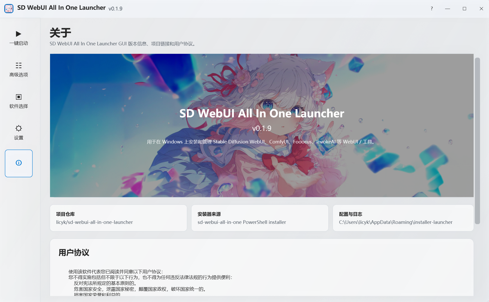

# Windows GUI Launcher

Windows GUI Launcher 是 `sd-webui-all-in-one-launcher` 的图形界面版本，是 Windows 上安装、启动和维护多个 WebUI / 训练工具的统一入口。它可以借助 `sd-webui-all-in-one` 安装器完成全新安装，也可以接管已解压的整合包或已有安装目录，继续运行启动、更新、终端、模型下载和版本管理等维护脚本。

项目地址：[licyk/sd-webui-all-in-one-launcher](https://github.com/licyk/sd-webui-all-in-one-launcher)。

## 下载与启动

[GitHub 下载 install.bat :material-download:](https://github.com/licyk/sd-webui-all-in-one-launcher/releases/download/launcher/install.bat){ .md-button .md-button--primary }
[Gitee 下载 install.bat :material-download:](https://gitee.com/licyk/sd-webui-all-in-one-launcher/releases/download/launcher/install.bat){ .md-button }

推荐下载 `install.bat` 后双击安装。安装完成后，可以从桌面或开始菜单启动 GUI。

如果已经下载源码，也可以手动运行：

```powershell
powershell -NoProfile -ExecutionPolicy Bypass -File .\install.ps1
```

临时试用 GUI：

```powershell
powershell -NoProfile -ExecutionPolicy Bypass -File .\installer_launcher_gui.ps1
```

## 支持管理的 WebUI / 工具

GUI 支持选择并管理以下 WebUI / 工具：

- Stable Diffusion WebUI
- ComfyUI
- InvokeAI
- Fooocus
- SD Trainer
- SD Trainer Script
- Qwen TTS WebUI

## 一键启动

“一键启动”页面会根据当前项目安装状态自动切换工作模式。



未安装或安装不完整时，使用“安装模式”借助安装器完成安装。安装前建议先到“高级选项”确认安装路径、安装分支、镜像和代理。



已安装，或安装路径指向已解压整合包并检测到管理脚本时，使用“启动模式”运行安装目录中的管理脚本。常用脚本包括：

- `launch.ps1`：启动当前 WebUI / 工具。
- `update.ps1`：更新当前 WebUI / 工具。
- `switch_branch.ps1`：切换支持的项目分支。
- `terminal.ps1`：打开交互终端。
- `download_models.ps1`：下载模型。
- `reinstall_pytorch.ps1`：重装或切换 PyTorch。
- `version_manager.ps1`：管理 WebUI、扩展或自定义节点版本。
- `settings.ps1`：管理安装器设置。

PowerShell 脚本会在独立控制台中运行。运行期间可以在 GUI 中使用“终止当前任务”，也可以在控制台中按 `Ctrl+C` 终止服务。

## 高级选项

“高级选项”用于配置安装路径、安装器参数和管理脚本参数，修改后会自动保存。



安装路径既用于判断当前项目是否已安装，也会作为 `-InstallPath` 传给安装器。这个路径可以是 Launcher 新安装的目录，也可以是已解压整合包或已有安装目录；只要目录中存在对应管理脚本，Launcher 就会进入启动 / 管理模式。

“搜索已安装 WebUI”适合接管已经解压的整合包或手动安装过的 WebUI。可以搜索当前系统，也可以选择一个目录进行搜索；Launcher 会根据 `launch_*_installer.ps1` 等特征脚本识别可管理目录，并按软件类型列出发现的安装实例。当前软件类型下的结果可以直接点击“设为当前管理目标”；如果发现的是其他类型，需要先到“软件选择”切换到对应软件后再选择该路径。卸载按钮会删除当前安装路径指向的已安装项目，并要求二次确认。



“安装器设置”只显示当前项目支持的安装参数，例如核心路径前缀、PyTorch 镜像类型、Python 版本、自定义代理、GitHub 镜像、HuggingFace 镜像和预下载开关。这些参数用于全新安装或重新运行安装器修复环境。



“管理脚本设置”用于给 `launch.ps1`、`download_models.ps1`、`reinstall_pytorch.ps1`、`settings.ps1`、`switch_branch.ps1`、`version_manager.ps1` 等脚本保存默认参数。额外原始参数会追加到结构化参数之后。

## 软件选择



在“软件选择”页面切换要安装或管理的 WebUI / 工具。切换后会自动刷新安装状态和可用脚本。

## 启动器设置



“设置”页面用于管理启动器自身：

- 启动时自动检查更新。
- 日志等级：`DEBUG`、`INFO`、`WARN`、`ERROR`。
- 代理模式：`auto` 读取 Windows 系统代理，`manual` 使用手动代理地址，`off` 清理当前启动器进程中的代理变量。
- 检查更新、查看日志、打开配置文件夹、创建快捷方式、卸载启动器。



“关于”页面显示版本、项目仓库、安装器来源、配置与日志路径，以及用户协议全文。

## 配置位置

```text
主配置: %APPDATA%\installer-launcher\main.json
GUI 脚本: %APPDATA%\installer-launcher\installer_launcher_gui.ps1
项目配置: %APPDATA%\installer-launcher\projects\<project>.json
缓存目录: %LOCALAPPDATA%\installer-launcher\cache\installers\<project>\
日志目录: %LOCALAPPDATA%\installer-launcher\logs\
```

安装器运行失败、脚本无法启动或自动更新失败时，优先查看日志目录。更多排查方式见 [故障排查](./troubleshooting.md)。
