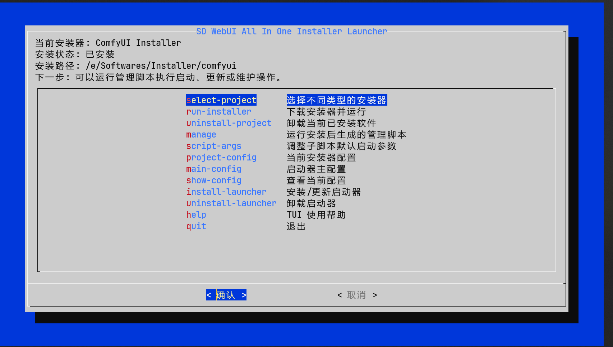
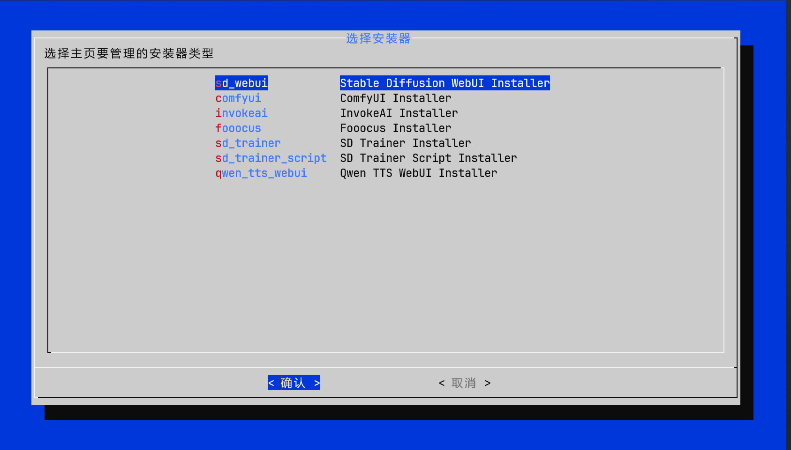
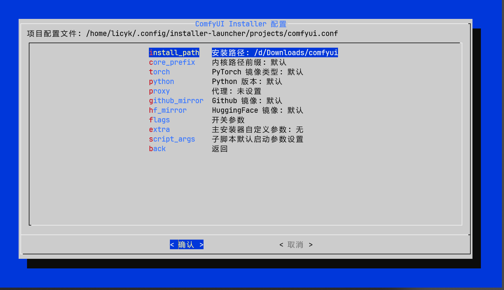
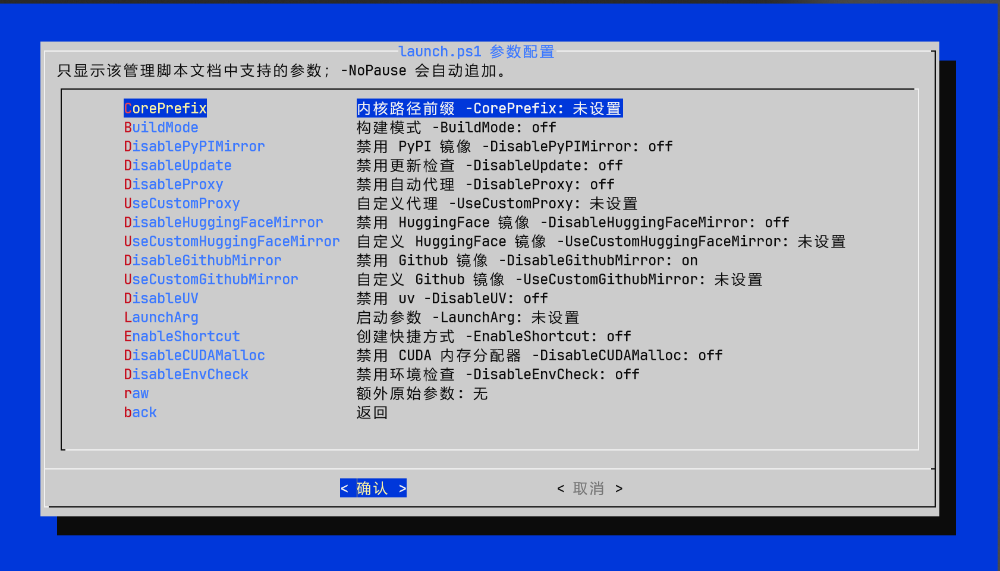
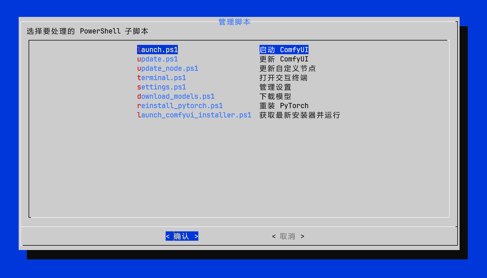
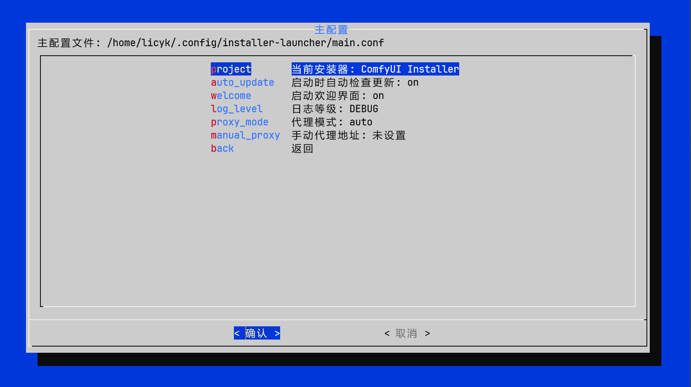

# Bash TUI / CLI Launcher

Bash TUI / CLI Launcher 是 `sd-webui-all-in-one-launcher` 的终端版本，是 Linux、macOS 或其他终端环境中安装、启动和维护 WebUI / 训练工具的统一入口。它可以借助 `sd-webui-all-in-one` 安装器完成全新安装，也可以接管已有安装目录，继续运行启动、更新、终端、模型下载和版本管理等维护脚本。TUI 依赖 `dialog` 提供终端图形界面；没有 `dialog` 时会退回到文本交互。

项目地址：[licyk/sd-webui-all-in-one-launcher](https://github.com/licyk/sd-webui-all-in-one-launcher)。

## 环境要求

- Bash 5 或更高版本。
- PowerShell：需要 `pwsh` 或 `powershell`，用于执行上游安装器和管理脚本。
- 下载工具：`curl` 或 `wget`。
- 可选：`dialog`，用于 TUI 界面。
- 可选：`git`，用于安装或更新启动器自身。

macOS 自带 Bash 版本通常较低。若低于 Bash 5，需要先安装 Homebrew Bash：

```bash
brew install bash
```

## 安装

推荐使用一键安装脚本：

```bash
curl -fsSL https://github.com/licyk/sd-webui-all-in-one-launcher/raw/main/install.sh | bash
```

如果已经下载源码，也可以在源码目录运行：

```bash
bash install.sh
```

从源码目录直接启动：

```bash
./installer_launcher.sh tui
```

注册 `installer-launcher` 命令：

```bash
./installer_launcher.sh install-launcher
```

安装后重新打开终端，或按脚本提示执行 `source`，即可使用：

```bash
installer-launcher tui
```

## TUI 主菜单



主菜单会显示当前安装器、安装状态、安装路径和下一步提示。常用入口包括：

- `select-project`：选择不同类型的安装器。
- `run-installer`：下载安装器并运行，用于全新安装或修复安装。
- `uninstall-project`：卸载当前已安装软件。
- `manage`：运行安装目录中的管理脚本，例如启动、更新、切换分支、下载模型、重装 PyTorch、版本管理和打开终端。
- `script-args`：调整子脚本默认启动参数。
- `project-config`：当前安装器配置。
- `main-config`：启动器主配置。
- `show-config`：查看当前配置。
- `install-launcher`：安装 / 更新启动器。
- `uninstall-launcher`：卸载启动器。
- `help`：TUI 使用帮助。

## 选择项目



支持项目包括 `sd_webui`、`comfyui`、`invokeai`、`fooocus`、`sd_trainer`、`sd_trainer_script` 和 `qwen_tts_webui`。选择后会写入主配置，并作为后续安装、运行脚本和查看配置的默认项目。

## 项目配置



项目配置会保存到当前用户配置目录。常见配置包括安装路径、核心路径前缀、PyTorch 镜像类型、Python 版本、代理、GitHub 镜像、HuggingFace 镜像、开关参数和子脚本默认参数。

安装路径可以是 Launcher 新安装的目录，也可以是已有安装目录。只要目录中存在对应管理脚本，TUI / CLI 就可以通过 `manage` 或 `run-script` 进入启动 / 管理流程。

## 管理脚本参数



管理脚本参数页面只显示该脚本文档中支持的参数。`-NoPause` 会自动追加。可以为 `launch.ps1`、`download_models.ps1`、`reinstall_pytorch.ps1`、`switch_branch.ps1`、`version_manager.ps1` 等脚本保存默认参数。

## 运行管理脚本



安装完成后，或把安装路径指向已有目录后，可以在 `manage` 中选择安装目录中的管理脚本，例如启动、更新、切换分支、打开终端、下载模型、重装 PyTorch、版本管理或重新运行安装器。

## 主配置



主配置包含当前项目、自动更新、欢迎页、日志等级、代理模式和手动代理地址。

## CLI 常用命令

查看帮助：

```bash
./installer_launcher.sh --help
```

列出支持项目：

```bash
./installer_launcher.sh list-projects
```

设置当前项目：

```bash
./installer_launcher.sh set-main CURRENT_PROJECT comfyui
```

运行安装器：

```bash
./installer_launcher.sh install comfyui
```

卸载已安装软件：

```bash
./installer_launcher.sh uninstall comfyui
```

查看配置：

```bash
./installer_launcher.sh config comfyui
```

设置项目安装路径：

```bash
./installer_launcher.sh set-project comfyui INSTALL_PATH /data/ComfyUI
```

设置安装分支：

```bash
./installer_launcher.sh set-project fooocus INSTALL_BRANCH fooocus_mre_main
```

保存管理脚本结构化参数：

```bash
./installer_launcher.sh set-script-param comfyui launch.ps1 LaunchArg "--listen 0.0.0.0 --port 8188"
./installer_launcher.sh set-script-param comfyui launch.ps1 DisableUpdate 1
```

追加额外原始参数：

```bash
./installer_launcher.sh set-script-args comfyui launch.ps1 "--listen 0.0.0.0 --port 8188"
```

运行管理脚本：

```bash
./installer_launcher.sh run-script launch.ps1
```

查看最近日志：

```bash
./installer_launcher.sh show-log 120
```

## 配置位置

```text
主配置: ${XDG_CONFIG_HOME:-$HOME/.config}/installer-launcher/main.conf
项目配置: ${XDG_CONFIG_HOME:-$HOME/.config}/installer-launcher/projects/<project>.conf
安装器缓存: ${XDG_CACHE_HOME:-$HOME/.cache}/installer-launcher/installers/<project>/
日志目录: ${XDG_STATE_HOME:-$HOME/.local/state}/installer-launcher/logs/
```

安装器下载失败、脚本执行失败或 TUI 无法显示时，先查看日志。更多排查方式见 [故障排查](./troubleshooting.md)。
