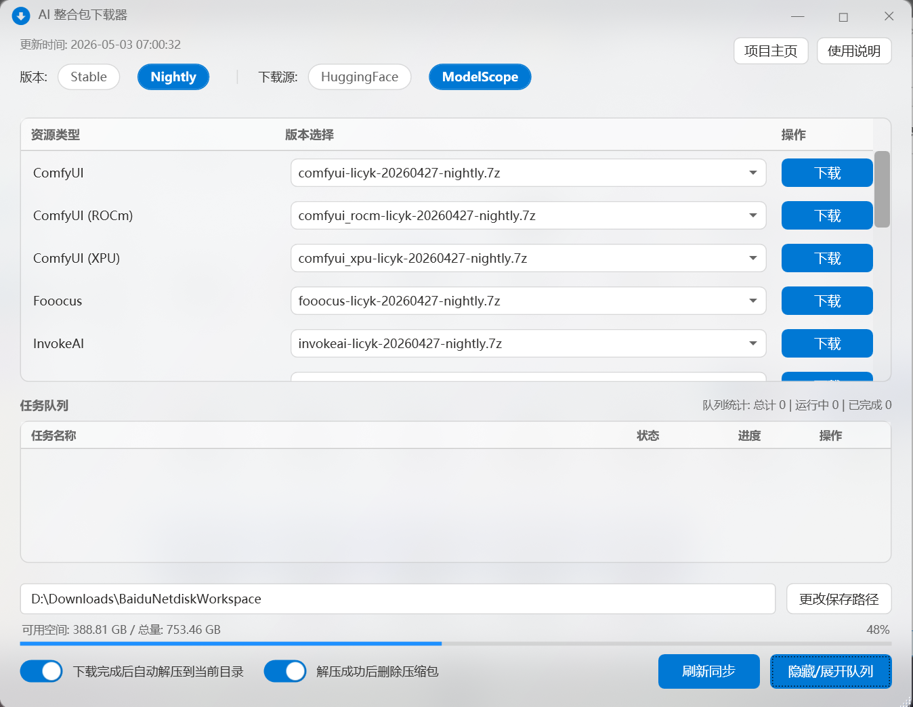

# AI 整合包下载器

AI 整合包下载器是 Windows 上的图形化下载工具，用于下载项目自动构建的整合包。它适合希望直接获取 7z 整合包、下载完成后自动解压使用的用户。

下载器只负责获取和解压整合包。整合包解压后，可以直接运行包内脚本，也可以交给 Launcher 统一启动、更新和维护。



## 下载入口

[GitHub 下载 :material-download:](https://github.com/licyk/sd-webui-all-in-one/releases/download/portable/sd_portable_downloader.bat){ .md-button .md-button--primary }
[Gitee 下载 :material-download:](https://gitee.com/licyk/sd-webui-all-in-one/releases/download/portable/sd_portable_downloader.bat){ .md-button }

下载 `sd_portable_downloader.bat` 后双击运行即可打开下载器。下载器界面会从远程资源列表同步可用整合包，并在列表中显示每个资源类型对应的版本文件。

## 基本使用

1. 在顶部选择版本：推荐优先使用 `Nightly`，`Stable` 相对较旧。
2. 在顶部选择下载源：可在 `HuggingFace` 和 `ModelScope` 之间切换。
3. 在列表中选择对应整合包版本，点击右侧“下载”。
4. 在底部确认保存路径，必要时点击“更改保存路径”。
5. 根据需要保留“下载完成后自动解压到当前目录”和“解压成功后删除压缩包”。
6. 等待任务队列完成；队列中可以查看状态、进度并取消任务。

## 下载后如何启动和管理

整合包解压完成后，有三种常见使用方式：

- 直接运行包内脚本：首次使用先运行 `configure_env.bat`，之后按需要运行 `launch.ps1`、`update.ps1`、`terminal.ps1`、`download_models.ps1`、`version_manager.ps1` 等脚本。
- 使用绘世启动器：部分整合包包含 `hanamizuki.bat`，双击后可通过绘世启动器启动和管理对应 WebUI。
- 使用 Windows GUI Launcher：选择对应 WebUI / 工具，把安装路径设置为整合包解压目录，然后在“一键启动”中运行 `launch.ps1` 或其他管理脚本。

使用 Launcher 接管整合包时，推荐流程：

1. 打开 [Windows GUI Launcher](./launcher-gui.md)。
2. 在“软件选择”中选择和整合包对应的项目，例如 ComfyUI 整合包选择 `ComfyUI Installer`。
3. 在“高级选项 -> 安装路径”中，把路径设置为整合包解压目录。
4. 返回“一键启动”，如果目录中存在对应管理脚本，Launcher 会进入启动 / 管理模式。
5. 选择 `launch.ps1` 启动 WebUI，或选择 `update.ps1`、`terminal.ps1`、`download_models.ps1`、`version_manager.ps1` 做维护。

WebUI 启动后，具体的界面使用、绘图流程、模型使用和常见使用问题可以继续阅读 [SD Note](https://licyk.github.io/SDNote/)。

## 主要功能

- 多下载源：支持 `HuggingFace` 和 `ModelScope`。
- 版本选择：支持 `Stable` 和 `Nightly`。
- 队列管理：下载任务会进入任务队列，自动按顺序执行。
- 自动解压：下载完成后可调用 7-Zip 解压到保存目录。
- 自动清理：解压成功后可删除压缩包。
- 磁盘监控：底部显示目标路径的可用空间、总量和占用比例。
- 刷新同步：点击“刷新同步”可重新获取远程资源列表。
- 队列显示：点击“隐藏/展开队列”可切换任务队列区域。
- 代理读取：启动时会读取 Windows 系统代理并设置到当前下载器进程。
- 断点续传：下载核心使用 Aria2，支持多线程和断点续传。

## 源码运行

如果已经下载项目源码，也可以直接运行 PowerShell 脚本：

```powershell
powershell -ExecutionPolicy Bypass -File ".\.github\sd_portable_downloader.ps1"
```

指定默认保存路径：

```powershell
powershell -ExecutionPolicy Bypass -File ".\.github\sd_portable_downloader.ps1" -ScriptRootPath "E:\AIModels"
```

`-ScriptRootPath` 只用于指定下载器启动时的根路径。下载器打开后仍然可以在界面中更改保存路径。

## 外部组件

下载器会自动获取或使用缓存组件：

- `aria2c.exe`：下载引擎，用于多线程下载和断点续传。
- `7za.exe`：解压工具，用于解压整合包。
- `portable_list.json`：远程整合包资源列表。

如果这些组件下载失败，通常需要检查网络、代理或安全软件拦截情况。排查方式见 [故障排查](./troubleshooting.md)。
